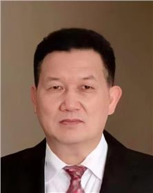

<!-- AUTO-GENERATED-BY: work/generate_obsidian_profiles.py -->

<!-- TEMPLATE: D:\workspace\信息收集整理\医生画像仓库\模板\医生画像模板.md -->

# 王伟光

## 基础信息

| 字段 | 内容 |
|---|---|
| 姓名 | 王伟光 |
| 医院 | 广东省妇幼保健院 |
| 科室 | 普通儿科、小儿肾内科（番禺院区、越秀院区） |
| 职称/身份 | 主任医师 |
| 来源链接 | [官网原文](https://www.e3861.com/keshizhuanjia/zhuanjiajieshao/32469.html) |
| 采集日期 | 2026-08-14 |

## 简介/擅长

## 可包装亮点

- 主任医师、儿科教授 获省政府三等功、羊城好医生，长期从事儿科临床医教研工作 37 年，擅长小儿肾脏泌尿、儿科急重疑难疾病及儿科常见病诊治，临床经验丰富。
- 社会任职： 1 广东省泌尿生殖协会小儿泌尿内科副主任委员 2 广东省药学会第一届儿童肾脏病专家委员会副主任委员 3 广东省医学会儿科肾脏病学组委员 4 广东省儿童肾脏风湿病专科联盟常务委员 5 广东省医师协会援疆医师分会委员 6 广东省保健协会儿童保健专业委员会第一届委员 7 亚太医学生物免疫学会儿童过敏与风湿病委员 8 国家科技部中国人类遗传资源管理评

## 重点疾病/人群标签

- 慢性病：
- 肿瘤：
- 生殖疾病：生殖、风湿、免疫、疑难
- 免疫/风湿：生殖、风湿、免疫、疑难
- 术后恢复/康复：
- 疑难重症：生殖、风湿、免疫、疑难

## 证据摘录

> 只摘录官网公开信息中的短句或关键字段，不复制大段原文。

- 官网身份字段：主任医师
- 官网亮眼经历线索：主任医师、儿科教授 获省政府三等功、羊城好医生，长期从事儿科临床医教研工作 37 年，擅长小儿肾脏泌尿、儿科急重疑难疾病及儿科常见病诊治，临床经验丰富。 社会任职： 1 广东省泌尿生殖协会小儿泌尿内科副主任委员 2 广东省药学会第一届儿童肾脏病专家委员会副主任委员 3 广东省医学会儿科肾脏病学组委员 4 广东省儿童肾脏风湿病专科联盟常务委员 5 广东省医师协会援疆医师分会委员 6 广东省保健协会儿童保健专业委员会第一届委员 7 亚太医…
- 来源链接：https://www.e3861.com/keshizhuanjia/zhuanjiajieshao/32469.html

## BD 画像摘要

王伟光医生可作为生殖疾病、免疫/风湿/感染、疑难重症方向的基础画像候选。后续 BD 使用应继续以官网来源和人工复核为准，不添加疗效承诺或无来源包装。

## 合规边界

- 仅使用医院官网、官方公众号、官方小程序等公开渠道。
- 不采集私人电话、私人微信、家庭住址、患者隐私或非公开排班信息。
- 不写“保证治愈”“疗效第一”“包治疑难杂症”等无法由官网证明的表述。
