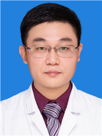

<!-- AUTO-GENERATED-BY: work/generate_obsidian_profiles.py -->

<!-- TEMPLATE: D:\workspace\信息收集整理\医生画像仓库\模板\医生画像模板.md -->

# 王建勋

## 基础信息

| 字段 | 内容 |
|---|---|
| 姓名 | 王建勋 |
| 医院 | 广东省妇幼保健院 |
| 科室 | 眼科（番禺院区、越秀院区、天河院区） |
| 职称/身份 | 主任医师 |
| 来源链接 | [官网原文](https://www.e3861.com/keshizhuanjia/zhuanjiajieshao/33176.html) |
| 采集日期 | 2026-08-14 |

## 简介/擅长

## 科研项目与成果

- 科研： 主持和参与省市级科研项目多项，因开展早产儿视网膜病变临床研究获全国妇幼健康科学技术奖及广州市科学技术进步奖。
- 荣誉： 首届“羊城工匠杯”儿童眼科项目金奖，2022年第八届“羊城好医生”。

## 论文与学术产出

- 发表国内外核心期刊论文多篇。

## 可包装亮点

- 眼科主任，主任医师，硕士研究生导师，共产党员。
- 社会任职： 中国医师协会眼科分会全国委员，中国医药教育协会儿童眼科专业委员会秘书长，中国医药教育协会青年委员会副主任委员，广东省医学会眼视光与近视防控学常务委员，广东省儿童青少年近视防控和视力健康专家宣讲团成员，广东省妇幼保健协会儿童眼保健副主任委员，广东省医师协会眼科医师分会委员等。
- 科研： 主持和参与省市级科研项目多项，因开展早产儿视网膜病变临床研究获全国妇幼健康科学技术奖及广州市科学技术进步奖。
- 发表国内外核心期刊论文多篇。

## 重点疾病/人群标签

- 慢性病：
- 肿瘤：
- 生殖疾病：
- 免疫/风湿：
- 术后恢复/康复：术后、康复、复杂
- 疑难重症：术后、康复、复杂

## 证据摘录

> 只摘录官网公开信息中的短句或关键字段，不复制大段原文。

- 官网身份字段：主任医师
- 官网亮眼经历线索：眼科主任，主任医师，硕士研究生导师，共产党员。 社会任职： 中国医师协会眼科分会全国委员，中国医药教育协会儿童眼科专业委员会秘书长，中国医药教育协会青年委员会副主任委员，广东省医学会眼视光与近视防控学常务委员，广东省儿童青少年近视防控和视力健康专家宣讲团成员，广东省妇幼保健协会儿童眼保健副主任委员，广东省医师协会眼科医师分会委员等。 科研： 主持和参与省市级科研项目多项，因开展早产儿视网膜病变临床研究获全国妇幼健康科学技术奖及广州市科…
- 来源链接：https://www.e3861.com/keshizhuanjia/zhuanjiajieshao/33176.html

## BD 画像摘要

王建勋医生可作为术后恢复/康复、疑难重症方向的基础画像候选。后续 BD 使用应继续以官网来源和人工复核为准，不添加疗效承诺或无来源包装。

## 合规边界

- 仅使用医院官网、官方公众号、官方小程序等公开渠道。
- 不采集私人电话、私人微信、家庭住址、患者隐私或非公开排班信息。
- 不写“保证治愈”“疗效第一”“包治疑难杂症”等无法由官网证明的表述。
