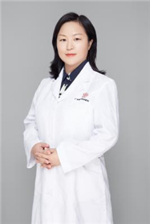

<!-- AUTO-GENERATED-BY: work/generate_obsidian_profiles.py -->

<!-- TEMPLATE: D:\workspace\信息收集整理\医生画像仓库\模板\医生画像模板.md -->

# 王逾男

## 基础信息

| 字段 | 内容 |
|---|---|
| 姓名 | 王逾男 |
| 医院 | 广东省妇幼保健院 |
| 科室 | 产前诊断（番禺院区） |
| 职称/身份 | 主治医师 |
| 来源链接 | [官网原文](https://www.e3861.com/keshizhuanjia/zhuanjiajieshao/33009.html) |
| 采集日期 | 2026-08-14 |

## 简介/擅长

## 科研项目与成果

- 医学硕士， 吴菁主任团队成员 特长： 致力于产前诊断及遗传咨询临床科研工作多年。
- 成果： 在专业相关国内外杂志发表论著、文章二十余篇，其中包括SCI论文6篇。
- 主持广东省医学科学技术研究基金项目1项，参与完成课题5项。

## 论文与学术产出

- 成果： 在专业相关国内外杂志发表论著、文章二十余篇，其中包括SCI论文6篇。

## 可包装亮点

- 成果： 在专业相关国内外杂志发表论著、文章二十余篇，其中包括SCI论文6篇。

## 重点疾病/人群标签

- 慢性病：
- 肿瘤：
- 生殖疾病：
- 免疫/风湿：
- 术后恢复/康复：
- 疑难重症：

## 证据摘录

> 只摘录官网公开信息中的短句或关键字段，不复制大段原文。

- 官网身份字段：主治医师
- 官网亮眼经历线索：成果： 在专业相关国内外杂志发表论著、文章二十余篇，其中包括SCI论文6篇。
- 来源链接：https://www.e3861.com/keshizhuanjia/zhuanjiajieshao/33009.html

## BD 画像摘要

王逾男医生可作为广东省妇幼保健院产前诊断（番禺院区）的基础医生资料入库。当前重点方向以总底表标签为准，官网未展示的信息保持空白。

## 合规边界

- 仅使用医院官网、官方公众号、官方小程序等公开渠道。
- 不采集私人电话、私人微信、家庭住址、患者隐私或非公开排班信息。
- 不写“保证治愈”“疗效第一”“包治疑难杂症”等无法由官网证明的表述。
