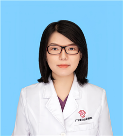

<!-- AUTO-GENERATED-BY: work/generate_obsidian_profiles.py -->

<!-- TEMPLATE: D:\workspace\信息收集整理\医生画像仓库\模板\医生画像模板.md -->

# 石婧

## 基础信息

| 字段 | 内容 |
|---|---|
| 姓名 | 石婧 |
| 医院 | 广东省妇幼保健院 |
| 科室 | 皮肤性病科（番禺院区、越秀院区） |
| 职称/身份 | 副主任医师 |
| 来源链接 | [官网原文](https://www.e3861.com/keshizhuanjia/zhuanjiajieshao/32876.html) |
| 采集日期 | 2026-08-14 |

## 简介/擅长

## 教育与进修经历

- 毕业于中南大学湘雅医学院，获得暨南大学皮肤科硕士学位。
- 获得2023年度哈佛大学医学院全球临床学者研究培训项目（Global Clinical Scholars Research Training）的证书，获得2019年法国尼斯大学面部美容解剖学证书( University Master of Superficial Facial Aesthetic Anatomy )；

## 科研项目与成果

- 获得2023年度哈佛大学医学院全球临床学者研究培训项目（Global Clinical Scholars Research Training）的证书，获得2019年法国尼斯大学面部美容解剖学证书( University Master of Superficial Facial Aesthetic Anatomy )；

## 可包装亮点

- 为欧洲皮肤病学和性病学学会（European Academy of Dermatology and Venereology）会员。

## 重点疾病/人群标签

- 慢性病：
- 肿瘤：
- 生殖疾病：
- 免疫/风湿：
- 术后恢复/康复：
- 疑难重症：

## 证据摘录

> 只摘录官网公开信息中的短句或关键字段，不复制大段原文。

- 官网身份字段：副主任医师
- 官网亮眼经历线索：为欧洲皮肤病学和性病学学会（European Academy of Dermatology and Venereology）会员。
- 来源链接：https://www.e3861.com/keshizhuanjia/zhuanjiajieshao/32876.html

## BD 画像摘要

石婧医生可作为广东省妇幼保健院皮肤性病科（番禺院区、越秀院区）的基础医生资料入库。当前重点方向以总底表标签为准，官网未展示的信息保持空白。

## 合规边界

- 仅使用医院官网、官方公众号、官方小程序等公开渠道。
- 不采集私人电话、私人微信、家庭住址、患者隐私或非公开排班信息。
- 不写“保证治愈”“疗效第一”“包治疑难杂症”等无法由官网证明的表述。
