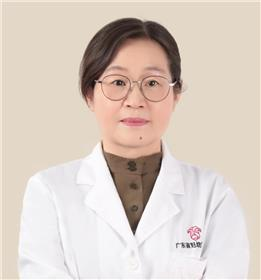

<!-- AUTO-GENERATED-BY: work/generate_obsidian_profiles.py -->

<!-- TEMPLATE: D:\workspace\信息收集整理\医生画像仓库\模板\医生画像模板.md -->

# 罗先琼

## 基础信息

| 字段 | 内容 |
|---|---|
| 姓名 | 罗先琼 |
| 医院 | 广东省妇幼保健院 |
| 科室 | 儿童内分泌遗传代谢（番禺院区、天河院区） |
| 职称/身份 | 主任医师 |
| 来源链接 | [官网原文](https://www.e3861.com/keshizhuanjia/zhuanjiajieshao/33040.html) |
| 采集日期 | 2026-08-14 |

## 简介/擅长

## 教育与进修经历

- 5、肾上腺疾病：肾上腺皮质增生、肾上腺皮质功能低下 6、性发育异常：小阴茎、其他性发育异常 7、儿童甲状腺疾病(甲状腺功能低下、甲亢、甲状腺功能异常等) 8、中西医结合性早熟诊疗 9、其他内分泌遗传代谢疾病 二、教育与学习经历 同济医科大学儿科学系 暨南大学儿科学硕士学位 华中科技大学同济医学院博士学位 曾在香港伊丽莎白医院及美国斯坦福医学中心学习 澳大利亚墨尔本MERCY医院访问学者 三、社会任职： 全国妇幼机构质量与安全专家 北京整合医学会儿童微生态与生长发育分会副主任委员 广东省医学会儿科分会副主任委员 广…

## 科研项目与成果

- 3、主持国家自然科学基金、省自然科学基金、省科技发展项目、市科委公关项目及其他项目等13项 4、发表论文70多篇、其中SCI12篇 5、编写专著1本（副主编） 6、获得全国妇幼健康科技奖励及广东省人民政府科技奖励8项 五、

## 论文与学术产出

- 3、主持国家自然科学基金、省自然科学基金、省科技发展项目、市科委公关项目及其他项目等13项 4、发表论文70多篇、其中SCI12篇 5、编写专著1本（副主编） 6、获得全国妇幼健康科技奖励及广东省人民政府科技奖励8项 五、

## 可包装亮点

- 儿童内分泌遗传代谢科主任、二级主任医师、博士、博士研究生导师。
- 首届“南粤好医生”暨羊城好医生。
- 低磷性佝偻病、成骨不全、软骨发育不全等） 4、儿童罕见病及疑难病诊治（特殊面容、多器官异常、基因问题等。
- 5、肾上腺疾病：肾上腺皮质增生、肾上腺皮质功能低下 6、性发育异常：小阴茎、其他性发育异常 7、儿童甲状腺疾病(甲状腺功能低下、甲亢、甲状腺功能异常等) 8、中西医结合性早熟诊疗 9、其他内分泌遗传代谢疾病 二、教育与学习经历 同济医科大学儿科学系 暨南大学儿科学硕士学位 华中科技大学同济医学院博士学位 曾在香港伊丽莎白医院及美国斯坦福医学中心学习 澳大利…

## 重点疾病/人群标签

- 慢性病：代谢、月经、疑难、罕见
- 肿瘤：
- 生殖疾病：代谢、月经、疑难、罕见
- 免疫/风湿：
- 术后恢复/康复：
- 疑难重症：代谢、月经、疑难、罕见

## 证据摘录

> 只摘录官网公开信息中的短句或关键字段，不复制大段原文。

- 官网身份字段：主任医师
- 官网亮眼经历线索：儿童内分泌遗传代谢科主任、二级主任医师、博士、博士研究生导师。 首届“南粤好医生”暨羊城好医生。 低磷性佝偻病、成骨不全、软骨发育不全等） 4、儿童罕见病及疑难病诊治（特殊面容、多器官异常、基因问题等。 5、肾上腺疾病：肾上腺皮质增生、肾上腺皮质功能低下 6、性发育异常：小阴茎、其他性发育异常 7、儿童甲状腺疾病(甲状腺功能低下、甲亢、甲状腺功能异常等) 8、中西医结合性早熟诊疗 9、其他内分泌遗传代谢疾病 二、教育与学习经历 同济医…
- 来源链接：https://www.e3861.com/keshizhuanjia/zhuanjiajieshao/33040.html

## BD 画像摘要

罗先琼医生可作为慢性病、生殖疾病、疑难重症方向的基础画像候选。后续 BD 使用应继续以官网来源和人工复核为准，不添加疗效承诺或无来源包装。

## 合规边界

- 仅使用医院官网、官方公众号、官方小程序等公开渠道。
- 不采集私人电话、私人微信、家庭住址、患者隐私或非公开排班信息。
- 不写“保证治愈”“疗效第一”“包治疑难杂症”等无法由官网证明的表述。
