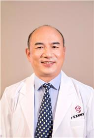

<!-- AUTO-GENERATED-BY: work/generate_obsidian_profiles.py -->

<!-- TEMPLATE: D:\workspace\信息收集整理\医生画像仓库\模板\医生画像模板.md -->

# 罗喜平

## 基础信息

| 字段 | 内容 |
|---|---|
| 姓名 | 罗喜平 |
| 医院 | 广东省妇幼保健院 |
| 科室 | 妇科（番禺院区、越秀院区、天河院区） |
| 职称/身份 | 主任医师 |
| 来源链接 | [官网原文](https://www.e3861.com/keshizhuanjia/zhuanjiajieshao/32510.html) |
| 采集日期 | 2026-08-14 |

## 简介/擅长

## 教育与进修经历

- 是卫生部四级内镜技术培训基地主任，国家宫颈癌防控技术培训基地主任，广东省宫颈癌防控技术培训中心负责人。

## 科研项目与成果

- 一直致力于妇科学科临床及科研三十余年，尤其是在妇科肿瘤、宫颈疾病、月经过多、女性生殖道畸形等妇科疾病的诊断和治疗经验丰富，是国内妇科腹腔镜、宫腔镜微创手术先行者之一。
- 主持广东省自然科学基金等科研项目三项，在SCI期刊发表论文30余篇，获广东省科技进步三等奖1项，二等奖2项。

## 论文与学术产出

- 主持广东省自然科学基金等科研项目三项，在SCI期刊发表论文30余篇，获广东省科技进步三等奖1项，二等奖2项。

## 可包装亮点

- 妇科学科带头人，一级主任医师，教授，博士生导师，国务院特殊津贴获得者。
- 最早国内开展微波子宫内膜去除术治疗月经过多，在国内率先开展全腹腔镜下乙状结肠代阴道成形手术治疗先天性阴道闭锁（石女）。
- 中国医师协会妇产科分会委员，中国优生优育协会宫颈疾病及阴道镜分会常委，中国妇幼保健协会妇科肿瘤专委会及宫内疾病专委会副主任委员，广东省妇幼保健协会妇科专委会首任主任委员，广东省医学会妇产科分会副主任委员，广东省医师协会妇产科分会副主任委员，广东省“五一”劳模，岭南名医。
- 主持广东省自然科学基金等科研项目三项，在SCI期刊发表论文30余篇，获广东省科技进步三等奖1项，二等奖2项。

## 重点疾病/人群标签

- 慢性病：
- 肿瘤：肿瘤、癌、生殖、月经
- 生殖疾病：肿瘤、癌、生殖、月经
- 免疫/风湿：
- 术后恢复/康复：
- 疑难重症：

## 证据摘录

> 只摘录官网公开信息中的短句或关键字段，不复制大段原文。

- 官网身份字段：主任医师
- 官网亮眼经历线索：妇科学科带头人，一级主任医师，教授，博士生导师，国务院特殊津贴获得者。 最早国内开展微波子宫内膜去除术治疗月经过多，在国内率先开展全腹腔镜下乙状结肠代阴道成形手术治疗先天性阴道闭锁（石女）。 中国医师协会妇产科分会委员，中国优生优育协会宫颈疾病及阴道镜分会常委，中国妇幼保健协会妇科肿瘤专委会及宫内疾病专委会副主任委员，广东省妇幼保健协会妇科专委会首任主任委员，广东省医学会妇产科分会副主任委员，广东省医师协会妇产科分会副主任委员，广东省…
- 来源链接：https://www.e3861.com/keshizhuanjia/zhuanjiajieshao/32510.html

## BD 画像摘要

罗喜平医生可作为肿瘤、生殖疾病方向的基础画像候选。后续 BD 使用应继续以官网来源和人工复核为准，不添加疗效承诺或无来源包装。

## 合规边界

- 仅使用医院官网、官方公众号、官方小程序等公开渠道。
- 不采集私人电话、私人微信、家庭住址、患者隐私或非公开排班信息。
- 不写“保证治愈”“疗效第一”“包治疑难杂症”等无法由官网证明的表述。
