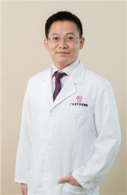

<!-- AUTO-GENERATED-BY: work/generate_obsidian_profiles.py -->

<!-- TEMPLATE: D:\workspace\信息收集整理\医生画像仓库\模板\医生画像模板.md -->

# 罗懿忠

## 基础信息

| 字段 | 内容 |
|---|---|
| 姓名 | 罗懿忠 |
| 医院 | 广东省妇幼保健院 |
| 科室 | 乳腺科（番禺院区、越秀院区） |
| 职称/身份 | 副主任医师 |
| 来源链接 | [官网原文](https://www.e3861.com/keshizhuanjia/zhuanjiajieshao/32789.html) |
| 采集日期 | 2026-08-14 |

## 简介/擅长

## 教育与进修经历

- 医学硕士 医院病案管理委员会委员 2006年毕业于中山医科大学 擅长： 乳腺疾病的微创手术，乳腺癌的早期诊断、保留乳房手术、乳房假体重建手术、乳腺癌的个体化全程综合治疗；

## 可包装亮点

- 医学硕士 医院病案管理委员会委员 2006年毕业于中山医科大学 擅长： 乳腺疾病的微创手术，乳腺癌的早期诊断、保留乳房手术、乳房假体重建手术、乳腺癌的个体化全程综合治疗；
- 社会任职： 广东省胸部疾病学会乳腺病防治专业委员会委员 广东省中西医结合学会乳腺专业委员会委员 广东省中医药学会乳腺专业委员会委员 广东省医疗行业协会乳腺病整形修复分会委员

## 重点疾病/人群标签

- 慢性病：
- 肿瘤：乳腺癌、疼痛
- 生殖疾病：
- 免疫/风湿：
- 术后恢复/康复：乳腺癌、疼痛
- 疑难重症：

## 证据摘录

> 只摘录官网公开信息中的短句或关键字段，不复制大段原文。

- 官网身份字段：副主任医师
- 官网亮眼经历线索：医学硕士 医院病案管理委员会委员 2006年毕业于中山医科大学 擅长： 乳腺疾病的微创手术，乳腺癌的早期诊断、保留乳房手术、乳房假体重建手术、乳腺癌的个体化全程综合治疗； 社会任职： 广东省胸部疾病学会乳腺病防治专业委员会委员 广东省中西医结合学会乳腺专业委员会委员 广东省中医药学会乳腺专业委员会委员 广东省医疗行业协会乳腺病整形修复分会委员
- 来源链接：https://www.e3861.com/keshizhuanjia/zhuanjiajieshao/32789.html

## BD 画像摘要

罗懿忠医生可作为肿瘤、术后恢复/康复方向的基础画像候选。后续 BD 使用应继续以官网来源和人工复核为准，不添加疗效承诺或无来源包装。

## 合规边界

- 仅使用医院官网、官方公众号、官方小程序等公开渠道。
- 不采集私人电话、私人微信、家庭住址、患者隐私或非公开排班信息。
- 不写“保证治愈”“疗效第一”“包治疑难杂症”等无法由官网证明的表述。
