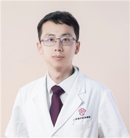

<!-- AUTO-GENERATED-BY: work/generate_obsidian_profiles.py -->

<!-- TEMPLATE: D:\workspace\信息收集整理\医生画像仓库\模板\医生画像模板.md -->

# 罗鑫刚

## 基础信息

| 字段 | 内容 |
|---|---|
| 姓名 | 罗鑫刚 |
| 医院 | 广东省妇幼保健院 |
| 科室 | 康复医学科（越秀院区） |
| 职称/身份 | 副主任医师 |
| 来源链接 | [官网原文](https://www.e3861.com/keshizhuanjia/zhuanjiajieshao/32713.html) |
| 采集日期 | 2026-08-14 |

## 简介/擅长

## 科研项目与成果

- 参与省级课题3项，发表专业论文3篇，发明实用新型专利4项。

## 论文与学术产出

- 参与省级课题3项，发表专业论文3篇，发明实用新型专利4项。

## 可包装亮点

- 康复医学科副主任医师 擅长各种脑损伤、脊髓损伤、周围神经损伤等所致的神经功能障碍、肌肉痉挛的肉毒毒素注射技术；
- 参与省级课题3项，发表专业论文3篇，发明实用新型专利4项。
- 学术兼职： 广东省康复医 学会儿童康复专业委员会常务委员 广东省康复医学会学习与发展障碍康复分会委员 广东省脑发育与脑病防治学会发育行为分会委员中华医学会儿科学分会神经学组抽动障碍协作组青年委员会委员

## 重点疾病/人群标签

- 慢性病：
- 肿瘤：
- 生殖疾病：
- 免疫/风湿：
- 术后恢复/康复：康复、功能障碍
- 疑难重症：

## 证据摘录

> 只摘录官网公开信息中的短句或关键字段，不复制大段原文。

- 官网身份字段：副主任医师
- 官网亮眼经历线索：康复医学科副主任医师 擅长各种脑损伤、脊髓损伤、周围神经损伤等所致的神经功能障碍、肌肉痉挛的肉毒毒素注射技术； 参与省级课题3项，发表专业论文3篇，发明实用新型专利4项。 学术兼职： 广东省康复医 学会儿童康复专业委员会常务委员 广东省康复医学会学习与发展障碍康复分会委员 广东省脑发育与脑病防治学会发育行为分会委员中华医学会儿科学分会神经学组抽动障碍协作组青年委员会委员
- 来源链接：https://www.e3861.com/keshizhuanjia/zhuanjiajieshao/32713.html

## BD 画像摘要

罗鑫刚医生可作为术后恢复/康复方向的基础画像候选。后续 BD 使用应继续以官网来源和人工复核为准，不添加疗效承诺或无来源包装。

## 合规边界

- 仅使用医院官网、官方公众号、官方小程序等公开渠道。
- 不采集私人电话、私人微信、家庭住址、患者隐私或非公开排班信息。
- 不写“保证治愈”“疗效第一”“包治疑难杂症”等无法由官网证明的表述。
