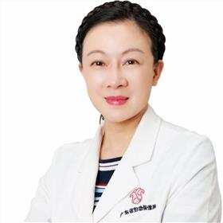

<!-- AUTO-GENERATED-BY: work/generate_obsidian_profiles.py -->

<!-- TEMPLATE: D:\workspace\信息收集整理\医生画像仓库\模板\医生画像模板.md -->

# 胡葵葵

## 基础信息

| 字段 | 内容 |
|---|---|
| 姓名 | 胡葵葵 |
| 医院 | 广东省妇幼保健院 |
| 科室 | 医疗美容科、血管瘤、医学美容科（番禺院区、越秀院区） |
| 职称/身份 | 主任医师 |
| 来源链接 | [官网原文](https://www.e3861.com/keshizhuanjia/zhuanjiajieshao/32457.html) |
| 采集日期 | 2026-08-14 |

## 简介/擅长

## 教育与进修经历

- 主任医师，教授，博士生导师 上海交通大学附属第九人民医院整形外科博士后 国际性美学与私密整形学会 中国区主席 中国整形美容协会抗衰老分会副会长 广东省整形美容协会面部年轻化专委会主任委员 主编《女性生殖器整形美容》，参编“面部年轻化”等书籍 擅长面部注射与皮肤抗衰 私密整形与抗衰 眼周，唇周抗衰，眼部，胸部整形

## 论文与学术产出

- 主任医师，教授，博士生导师 上海交通大学附属第九人民医院整形外科博士后 国际性美学与私密整形学会 中国区主席 中国整形美容协会抗衰老分会副会长 广东省整形美容协会面部年轻化专委会主任委员 主编《女性生殖器整形美容》，参编“面部年轻化”等书籍 擅长面部注射与皮肤抗衰 私密整形与抗衰 眼周，唇周抗衰，眼部，胸部整形

## 可包装亮点

- 主任医师，教授，博士生导师 上海交通大学附属第九人民医院整形外科博士后 国际性美学与私密整形学会 中国区主席 中国整形美容协会抗衰老分会副会长 广东省整形美容协会面部年轻化专委会主任委员 主编《女性生殖器整形美容》，参编“面部年轻化”等书籍 擅长面部注射与皮肤抗衰 私密整形与抗衰 眼周，唇周抗衰，眼部，胸部整形

## 重点疾病/人群标签

- 慢性病：
- 肿瘤：瘤、生殖
- 生殖疾病：瘤、生殖
- 免疫/风湿：
- 术后恢复/康复：
- 疑难重症：

## 证据摘录

> 只摘录官网公开信息中的短句或关键字段，不复制大段原文。

- 官网身份字段：主任医师
- 官网亮眼经历线索：主任医师，教授，博士生导师 上海交通大学附属第九人民医院整形外科博士后 国际性美学与私密整形学会 中国区主席 中国整形美容协会抗衰老分会副会长 广东省整形美容协会面部年轻化专委会主任委员 主编《女性生殖器整形美容》，参编“面部年轻化”等书籍 擅长面部注射与皮肤抗衰 私密整形与抗衰 眼周，唇周抗衰，眼部，胸部整形
- 来源链接：https://www.e3861.com/keshizhuanjia/zhuanjiajieshao/32457.html

## BD 画像摘要

胡葵葵医生可作为肿瘤、生殖疾病方向的基础画像候选。后续 BD 使用应继续以官网来源和人工复核为准，不添加疗效承诺或无来源包装。

## 合规边界

- 仅使用医院官网、官方公众号、官方小程序等公开渠道。
- 不采集私人电话、私人微信、家庭住址、患者隐私或非公开排班信息。
- 不写“保证治愈”“疗效第一”“包治疑难杂症”等无法由官网证明的表述。
