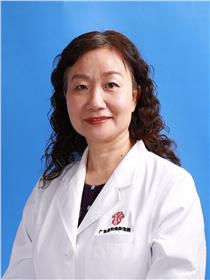

<!-- AUTO-GENERATED-BY: work/generate_obsidian_profiles.py -->

<!-- TEMPLATE: D:\workspace\信息收集整理\医生画像仓库\模板\医生画像模板.md -->

# 薛素华

## 基础信息

| 字段 | 内容 |
|---|---|
| 姓名 | 薛素华 |
| 医院 | 广东省妇幼保健院 |
| 科室 | 妇科（番禺院区） |
| 职称/身份 | 主任医师 |
| 来源链接 | [官网原文](https://www.e3861.com/keshizhuanjia/zhuanjiajieshao/32515.html) |
| 采集日期 | 2026-08-14 |

## 简介/擅长

## 教育与进修经历

- 从事妇产科临床、科研、教学工作近40年，主要从事妇科肿瘤及盆腔疼痛和妇科内分泌疾病的诊治，曾到澳大利亚进修妇科内窥镜。
- 参与卫生部内镜培训中心工作并担任教员；
- 主持《广东省卫生厅妇幼安康工程之妇科生殖道感染综合防治》项目培训和实施。

## 科研项目与成果

- 从事妇产科临床、科研、教学工作近40年，主要从事妇科肿瘤及盆腔疼痛和妇科内分泌疾病的诊治，曾到澳大利亚进修妇科内窥镜。
- 参与卫生部“生殖道感染防治”项目的实施。
- 主持《广东省卫生厅妇幼安康工程之妇科生殖道感染综合防治》项目培训和实施。
- 主持多项课题包括慢性盆腔疼痛的研究，以及子宫内膜异位症复发的研究等。

## 论文与学术产出

- 近年来共发表专业学术论文30多篇，其中妇科腹腔镜专科论文30多篇。

## 可包装亮点

- 妇产科主任医师。
- 从事妇产科临床、科研、教学工作近40年，主要从事妇科肿瘤及盆腔疼痛和妇科内分泌疾病的诊治，曾到澳大利亚进修妇科内窥镜。
- 擅长疑难疾病的诊治及妇科微创技术。
- 主要社会任职（1）中华医学会妇产科学会广州分会第九、十、十一届委员；

## 重点疾病/人群标签

- 慢性病：慢性、肿瘤、生殖、妇科内分泌、感染、疼痛、疑难
- 肿瘤：慢性、肿瘤、生殖、妇科内分泌、感染、疼痛、疑难
- 生殖疾病：慢性、肿瘤、生殖、妇科内分泌、感染、疼痛、疑难
- 免疫/风湿：慢性、肿瘤、生殖、妇科内分泌、感染、疼痛、疑难
- 术后恢复/康复：慢性、肿瘤、生殖、妇科内分泌、感染、疼痛、疑难
- 疑难重症：慢性、肿瘤、生殖、妇科内分泌、感染、疼痛、疑难

## 证据摘录

> 只摘录官网公开信息中的短句或关键字段，不复制大段原文。

- 官网身份字段：主任医师
- 官网亮眼经历线索：妇产科主任医师。 从事妇产科临床、科研、教学工作近40年，主要从事妇科肿瘤及盆腔疼痛和妇科内分泌疾病的诊治，曾到澳大利亚进修妇科内窥镜。 擅长疑难疾病的诊治及妇科微创技术。 主要社会任职（1）中华医学会妇产科学会广州分会第九、十、十一届委员；
- 来源链接：https://www.e3861.com/keshizhuanjia/zhuanjiajieshao/32515.html

## BD 画像摘要

薛素华医生可作为慢性病、肿瘤、生殖疾病、免疫/风湿/感染、术后恢复/康复、疑难重症方向的基础画像候选。后续 BD 使用应继续以官网来源和人工复核为准，不添加疗效承诺或无来源包装。

## 合规边界

- 仅使用医院官网、官方公众号、官方小程序等公开渠道。
- 不采集私人电话、私人微信、家庭住址、患者隐私或非公开排班信息。
- 不写“保证治愈”“疗效第一”“包治疑难杂症”等无法由官网证明的表述。
