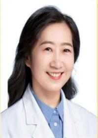

<!-- AUTO-GENERATED-BY: work/generate_obsidian_profiles.py -->

<!-- TEMPLATE: D:\workspace\信息收集整理\医生画像仓库\模板\医生画像模板.md -->

# 袁晓兰

## 基础信息

| 字段 | 内容 |
|---|---|
| 姓名 | 袁晓兰 |
| 医院 | 广东省妇幼保健院 |
| 科室 | 产科（番禺院区） |
| 职称/身份 | 主任医师 |
| 来源链接 | [官网原文](https://www.e3861.com/keshizhuanjia/zhuanjiajieshao/32486.html) |
| 采集日期 | 2026-08-14 |

## 简介/擅长

产科凶险性前置胎盘、产后出血、妊娠期高血压疾病等急危重症病人的诊治及抢救、难产处理、高危妊娠管理、围产期保健等。

## 可包装亮点

- 产科一党支部书记 广东省妇幼保健院胎盘源性疾病专科主任 主任医师 社会任职： 中国优生科学协会妇儿临床分会常务委员；
- 中国优生科学协会妇儿临床分会产科快速康复学组委员；
- 广东省医师协会妇产科医师分会第三届委员会产科专业组成员；
- 广东省免疫学会生殖免疫学专业委员会委员。

## 重点疾病/人群标签

- 慢性病：高血压、生殖、免疫、康复、急危重、高危
- 肿瘤：
- 生殖疾病：高血压、生殖、免疫、康复、急危重、高危
- 免疫/风湿：高血压、生殖、免疫、康复、急危重、高危
- 术后恢复/康复：高血压、生殖、免疫、康复、急危重、高危
- 疑难重症：高血压、生殖、免疫、康复、急危重、高危

## 证据摘录

> 只摘录官网公开信息中的短句或关键字段，不复制大段原文。

- 官网身份字段：主任医师
- 官网简介/擅长：产科凶险性前置胎盘、产后出血、妊娠期高血压疾病等急危重症病人的诊治及抢救、难产处理、高危妊娠管理、围产期保健等。
- 官网亮眼经历线索：产科一党支部书记 广东省妇幼保健院胎盘源性疾病专科主任 主任医师 社会任职： 中国优生科学协会妇儿临床分会常务委员； 中国优生科学协会妇儿临床分会产科快速康复学组委员； 广东省医师协会妇产科医师分会第三届委员会产科专业组成员； 广东省免疫学会生殖免疫学专业委员会委员。
- 来源链接：https://www.e3861.com/keshizhuanjia/zhuanjiajieshao/32486.html

## BD 画像摘要

袁晓兰医生可作为慢性病、生殖疾病、免疫/风湿/感染、术后恢复/康复、疑难重症方向的基础画像候选。后续 BD 使用应继续以官网来源和人工复核为准，不添加疗效承诺或无来源包装。

## 合规边界

- 仅使用医院官网、官方公众号、官方小程序等公开渠道。
- 不采集私人电话、私人微信、家庭住址、患者隐私或非公开排班信息。
- 不写“保证治愈”“疗效第一”“包治疑难杂症”等无法由官网证明的表述。
