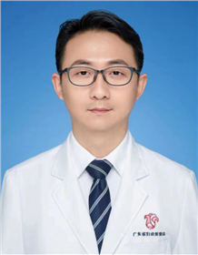

<!-- AUTO-GENERATED-BY: work/generate_obsidian_profiles.py -->

<!-- TEMPLATE: D:\workspace\信息收集整理\医生画像仓库\模板\医生画像模板.md -->

# 裴铮

## 基础信息

| 字段 | 内容 |
|---|---|
| 姓名 | 裴铮 |
| 医院 | 广东省妇幼保健院 |
| 科室 | 儿科、小儿内科神经内科（天河院区） |
| 职称/身份 | 主治医师 |
| 来源链接 | [官网原文](https://www.e3861.com/keshizhuanjia/zhuanjiajieshao/32773.html) |
| 采集日期 | 2026-08-14 |

## 简介/擅长

癫痫、脑炎、肌无力、睡眠障碍、热性惊厥、脑白质病等神经系统疾病；脑性瘫痪、智力低下、童年孤独症等儿童发育性疾病；行为异常疾病：多动症、抽动障碍等。擅长儿童神经影像的判读。

## 教育与进修经历

- 神经、康复科主治医师，曾在北京大学第一医院儿童神经影像、复旦大学附属儿科医院神经内科进修学习。

## 可包装亮点

- 神经、康复科主治医师，曾在北京大学第一医院儿童神经影像、复旦大学附属儿科医院神经内科进修学习。
- 任广东省残疾人康复协会智障专业委员会委员

## 重点疾病/人群标签

- 慢性病：
- 肿瘤：
- 生殖疾病：
- 免疫/风湿：
- 术后恢复/康复：康复
- 疑难重症：

## 证据摘录

> 只摘录官网公开信息中的短句或关键字段，不复制大段原文。

- 官网身份字段：主治医师
- 官网简介/擅长：癫痫、脑炎、肌无力、睡眠障碍、热性惊厥、脑白质病等神经系统疾病；脑性瘫痪、智力低下、童年孤独症等儿童发育性疾病；行为异常疾病：多动症、抽动障碍等。擅长儿童神经影像的判读。
- 官网亮眼经历线索：神经、康复科主治医师，曾在北京大学第一医院儿童神经影像、复旦大学附属儿科医院神经内科进修学习。 任广东省残疾人康复协会智障专业委员会委员
- 来源链接：https://www.e3861.com/keshizhuanjia/zhuanjiajieshao/32773.html

## BD 画像摘要

裴铮医生可作为术后恢复/康复方向的基础画像候选。后续 BD 使用应继续以官网来源和人工复核为准，不添加疗效承诺或无来源包装。

## 合规边界

- 仅使用医院官网、官方公众号、官方小程序等公开渠道。
- 不采集私人电话、私人微信、家庭住址、患者隐私或非公开排班信息。
- 不写“保证治愈”“疗效第一”“包治疑难杂症”等无法由官网证明的表述。
