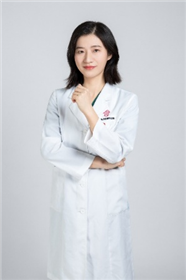

<!-- AUTO-GENERATED-BY: work/generate_obsidian_profiles.py -->

<!-- TEMPLATE: D:\workspace\信息收集整理\医生画像仓库\模板\医生画像模板.md -->

# 谢素贞

## 基础信息

| 字段 | 内容 |
|---|---|
| 姓名 | 谢素贞 |
| 医院 | 广东省妇幼保健院 |
| 科室 | 眼科、儿童过敏多学科联合（番禺院区） |
| 职称/身份 | 副主任医师 |
| 来源链接 | [官网原文](https://www.e3861.com/keshizhuanjia/zhuanjiajieshao/32815.html) |
| 采集日期 | 2026-08-14 |

## 简介/擅长

## 科研项目与成果

- 科研及荣誉： 主持广东省医学科研基金项目，参与多项国家级、省级科学基金研究，公开发表多篇SCI、中文核心期刊论文，多次获得省市级科技进步奖，荣获2025年第十一届“羊城好医生”。

## 论文与学术产出

- 科研及荣誉： 主持广东省医学科研基金项目，参与多项国家级、省级科学基金研究，公开发表多篇SCI、中文核心期刊论文，多次获得省市级科技进步奖，荣获2025年第十一届“羊城好医生”。

## 可包装亮点

- 副主任医师，共产党员 擅长： 从事眼科临床与教学工作近二十年，具有丰富的临床经验，曾在美国ARVO会议进行学习交流，熟练掌握眼科常见病、多发病的诊治技术，尤其擅长早产儿视网膜病变、眼表与角膜病、近视、远视、散光、斜弱视的诊治。
- 社会任职： 广东省医学会眼科学分会青年委员，广东省视光学会斜视弱视专业委员会委员，广东省视光学会视觉康复专业委员会常务委员，广东省保健协会视觉保健分会委员，广东省医院协会眼病管理专业委员会委员。
- 科研及荣誉： 主持广东省医学科研基金项目，参与多项国家级、省级科学基金研究，公开发表多篇SCI、中文核心期刊论文，多次获得省市级科技进步奖，荣获2025年第十一届“羊城好医生”。

## 重点疾病/人群标签

- 慢性病：
- 肿瘤：
- 生殖疾病：
- 免疫/风湿：
- 术后恢复/康复：康复、多学科
- 疑难重症：康复、多学科

## 证据摘录

> 只摘录官网公开信息中的短句或关键字段，不复制大段原文。

- 官网身份字段：副主任医师
- 官网亮眼经历线索：副主任医师，共产党员 擅长： 从事眼科临床与教学工作近二十年，具有丰富的临床经验，曾在美国ARVO会议进行学习交流，熟练掌握眼科常见病、多发病的诊治技术，尤其擅长早产儿视网膜病变、眼表与角膜病、近视、远视、散光、斜弱视的诊治。 社会任职： 广东省医学会眼科学分会青年委员，广东省视光学会斜视弱视专业委员会委员，广东省视光学会视觉康复专业委员会常务委员，广东省保健协会视觉保健分会委员，广东省医院协会眼病管理专业委员会委员。 科研及荣誉：…
- 来源链接：https://www.e3861.com/keshizhuanjia/zhuanjiajieshao/32815.html

## BD 画像摘要

谢素贞医生可作为术后恢复/康复、疑难重症方向的基础画像候选。后续 BD 使用应继续以官网来源和人工复核为准，不添加疗效承诺或无来源包装。

## 合规边界

- 仅使用医院官网、官方公众号、官方小程序等公开渠道。
- 不采集私人电话、私人微信、家庭住址、患者隐私或非公开排班信息。
- 不写“保证治愈”“疗效第一”“包治疑难杂症”等无法由官网证明的表述。
