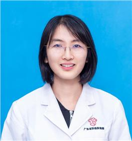

<!-- AUTO-GENERATED-BY: work/generate_obsidian_profiles.py -->

<!-- TEMPLATE: D:\workspace\信息收集整理\医生画像仓库\模板\医生画像模板.md -->

# 谭艳芳

## 基础信息

| 字段 | 内容 |
|---|---|
| 姓名 | 谭艳芳 |
| 医院 | 广东省妇幼保健院 |
| 科室 | 儿科呼吸（番禺院区） |
| 职称/身份 | 副主任医师 |
| 来源链接 | [官网原文](https://www.e3861.com/keshizhuanjia/zhuanjiajieshao/32838.html) |
| 采集日期 | 2026-08-14 |

## 简介/擅长

## 教育与进修经历

- 医学硕士 ，毕业于中山大学，获悉尼大学远程教育儿科学位，曾至美国波士顿儿童医院、加拿大温尼格大学总医院访问学习 专业擅长： 从事于儿科临床工作十余年，擅长儿童感染性及过敏性呼吸道疾病的诊治，熟练掌握儿童肺功能及儿童支气管镜检查技术。

## 可包装亮点

- 医学硕士 ，毕业于中山大学，获悉尼大学远程教育儿科学位，曾至美国波士顿儿童医院、加拿大温尼格大学总医院访问学习 专业擅长： 从事于儿科临床工作十余年，擅长儿童感染性及过敏性呼吸道疾病的诊治，熟练掌握儿童肺功能及儿童支气管镜检查技术。
- 主要研究领域为儿童慢性肺疾病管理、儿童反复呼吸道感染、儿童反复喘息及儿童呼吸道疑难疾病诊治等。
- 社会任职： 广东省医学会儿童分会呼吸学组儿童肺功能协助组委员、广东省医学会儿童危重病医学会重症康复学组委员、广东省儿童哮喘专科标准化门诊导师

## 重点疾病/人群标签

- 慢性病：慢性、感染、康复、疑难、危重、重症
- 肿瘤：
- 生殖疾病：
- 免疫/风湿：慢性、感染、康复、疑难、危重、重症
- 术后恢复/康复：慢性、感染、康复、疑难、危重、重症
- 疑难重症：慢性、感染、康复、疑难、危重、重症

## 证据摘录

> 只摘录官网公开信息中的短句或关键字段，不复制大段原文。

- 官网身份字段：副主任医师
- 官网亮眼经历线索：医学硕士 ，毕业于中山大学，获悉尼大学远程教育儿科学位，曾至美国波士顿儿童医院、加拿大温尼格大学总医院访问学习 专业擅长： 从事于儿科临床工作十余年，擅长儿童感染性及过敏性呼吸道疾病的诊治，熟练掌握儿童肺功能及儿童支气管镜检查技术。 主要研究领域为儿童慢性肺疾病管理、儿童反复呼吸道感染、儿童反复喘息及儿童呼吸道疑难疾病诊治等。 社会任职： 广东省医学会儿童分会呼吸学组儿童肺功能协助组委员、广东省医学会儿童危重病医学会重症康复学组委员…
- 来源链接：https://www.e3861.com/keshizhuanjia/zhuanjiajieshao/32838.html

## BD 画像摘要

谭艳芳医生可作为慢性病、免疫/风湿/感染、术后恢复/康复、疑难重症方向的基础画像候选。后续 BD 使用应继续以官网来源和人工复核为准，不添加疗效承诺或无来源包装。

## 合规边界

- 仅使用医院官网、官方公众号、官方小程序等公开渠道。
- 不采集私人电话、私人微信、家庭住址、患者隐私或非公开排班信息。
- 不写“保证治愈”“疗效第一”“包治疑难杂症”等无法由官网证明的表述。
