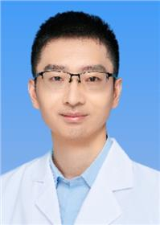

<!-- AUTO-GENERATED-BY: work/generate_obsidian_profiles.py -->

<!-- TEMPLATE: D:\workspace\信息收集整理\医生画像仓库\模板\医生画像模板.md -->

# 谭虎

## 基础信息

| 字段 | 内容 |
|---|---|
| 姓名 | 谭虎 |
| 医院 | 广东省妇幼保健院 |
| 科室 | 生殖健康与不孕症科（番禺院区） |
| 职称/身份 | 主治医师 |
| 来源链接 | [官网原文](https://www.e3861.com/keshizhuanjia/zhuanjiajieshao/32664.html) |
| 采集日期 | 2026-08-14 |

## 简介/擅长

擅长第三代试管婴儿的咨询与临床诊治以及不孕不育、反复流产等领域的遗传学诊断，熟悉女性不孕不育、妇科内分泌疾病、反复流产、人工授精、体外受精-胚胎移植等辅助生殖技术的常规诊治。

## 教育与进修经历

- 医学博士/妇产科博士后经历 学术任职：中国优生科学协会妇儿临床分会青年委员；

## 科研项目与成果

- 参与编写多个临床指南，参编多本专著或教材，主持省级科研项目1项，参与国家级科研项目3项。

## 论文与学术产出

- 研究方向：不孕不育、复发性流产、遗传病的生育指导，多次参加省级及全国的学术会议，并做汇报，在国内外发表论文20余篇；
- 参与编写多个临床指南，参编多本专著或教材，主持省级科研项目1项，参与国家级科研项目3项。

## 可包装亮点

- 医学博士/妇产科博士后经历 学术任职：中国优生科学协会妇儿临床分会青年委员；
- 研究方向：不孕不育、复发性流产、遗传病的生育指导，多次参加省级及全国的学术会议，并做汇报，在国内外发表论文20余篇；
- 参与编写多个临床指南，参编多本专著或教材，主持省级科研项目1项，参与国家级科研项目3项。

## 重点疾病/人群标签

- 慢性病：
- 肿瘤：
- 生殖疾病：生殖、不孕、辅助生殖、试管、胚胎、妇科内分泌
- 免疫/风湿：
- 术后恢复/康复：
- 疑难重症：

## 证据摘录

> 只摘录官网公开信息中的短句或关键字段，不复制大段原文。

- 官网身份字段：主治医师
- 官网简介/擅长：擅长第三代试管婴儿的咨询与临床诊治以及不孕不育、反复流产等领域的遗传学诊断，熟悉女性不孕不育、妇科内分泌疾病、反复流产、人工授精、体外受精-胚胎移植等辅助生殖技术的常规诊治。
- 官网亮眼经历线索：医学博士/妇产科博士后经历 学术任职：中国优生科学协会妇儿临床分会青年委员； 研究方向：不孕不育、复发性流产、遗传病的生育指导，多次参加省级及全国的学术会议，并做汇报，在国内外发表论文20余篇； 参与编写多个临床指南，参编多本专著或教材，主持省级科研项目1项，参与国家级科研项目3项。
- 来源链接：https://www.e3861.com/keshizhuanjia/zhuanjiajieshao/32664.html

## BD 画像摘要

谭虎医生可作为生殖疾病方向的基础画像候选。后续 BD 使用应继续以官网来源和人工复核为准，不添加疗效承诺或无来源包装。

## 合规边界

- 仅使用医院官网、官方公众号、官方小程序等公开渠道。
- 不采集私人电话、私人微信、家庭住址、患者隐私或非公开排班信息。
- 不写“保证治愈”“疗效第一”“包治疑难杂症”等无法由官网证明的表述。
