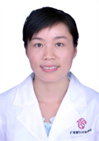

<!-- AUTO-GENERATED-BY: work/generate_obsidian_profiles.py -->

<!-- TEMPLATE: D:\workspace\信息收集整理\医生画像仓库\模板\医生画像模板.md -->

# 贺丽荣

## 基础信息

| 字段 | 内容 |
|---|---|
| 姓名 | 贺丽荣 |
| 医院 | 广东省妇幼保健院 |
| 科室 | 产科（番禺院区） |
| 职称/身份 | 副主任医师 |
| 来源链接 | [官网原文](https://www.e3861.com/keshizhuanjia/zhuanjiajieshao/32637.html) |
| 采集日期 | 2026-08-14 |

## 简介/擅长

## 教育与进修经历

- 广东省妇幼产科质量控制员 副主任医师 个人简介 毕业中山大学，医学硕士研究生，从事妇产科临床工作十余年，擅长产科常见病诊治，高危妊娠（妊娠期高血压疾病、妊娠期糖尿病、前置胎盘、胎儿生长受限、肝内胆汁淤积症、免疫性疾病）等疾病的诊治，高危孕妇的优生咨询及处理，擅长剖宫产、阴道助产、臀助产等手术及操作技术精湛，在阴道分娩产程处理、产科危急重症、疑难性疾病、产后出血、复杂性剖宫产、头位难产等具有丰富经验。

## 科研项目与成果

- 参与省级课题一项，获省级科技进步奖二等奖一项，著作一部，在国内外专业期刊发表论文十余篇，发表科普文章８篇。

## 论文与学术产出

- 参与省级课题一项，获省级科技进步奖二等奖一项，著作一部，在国内外专业期刊发表论文十余篇，发表科普文章８篇。

## 可包装亮点

- 广东省妇幼产科质量控制员 副主任医师 个人简介 毕业中山大学，医学硕士研究生，从事妇产科临床工作十余年，擅长产科常见病诊治，高危妊娠（妊娠期高血压疾病、妊娠期糖尿病、前置胎盘、胎儿生长受限、肝内胆汁淤积症、免疫性疾病）等疾病的诊治，高危孕妇的优生咨询及处理，擅长剖宫产、阴道助产、臀助产等手术及操作技术精湛，在阴道分娩产程处理、产科危急重症、疑难性疾病、产后…
- 参与省级课题一项，获省级科技进步奖二等奖一项，著作一部，在国内外专业期刊发表论文十余篇，发表科普文章８篇。

## 重点疾病/人群标签

- 慢性病：高血压、糖尿病、免疫、疑难、重症、复杂、高危
- 肿瘤：
- 生殖疾病：
- 免疫/风湿：高血压、糖尿病、免疫、疑难、重症、复杂、高危
- 术后恢复/康复：
- 疑难重症：高血压、糖尿病、免疫、疑难、重症、复杂、高危

## 证据摘录

> 只摘录官网公开信息中的短句或关键字段，不复制大段原文。

- 官网身份字段：副主任医师
- 官网亮眼经历线索：广东省妇幼产科质量控制员 副主任医师 个人简介 毕业中山大学，医学硕士研究生，从事妇产科临床工作十余年，擅长产科常见病诊治，高危妊娠（妊娠期高血压疾病、妊娠期糖尿病、前置胎盘、胎儿生长受限、肝内胆汁淤积症、免疫性疾病）等疾病的诊治，高危孕妇的优生咨询及处理，擅长剖宫产、阴道助产、臀助产等手术及操作技术精湛，在阴道分娩产程处理、产科危急重症、疑难性疾病、产后出血、复杂性剖宫产、头位难产等具有丰富经验。 参与省级课题一项，获省级科技进步奖…
- 来源链接：https://www.e3861.com/keshizhuanjia/zhuanjiajieshao/32637.html

## BD 画像摘要

贺丽荣医生可作为慢性病、免疫/风湿/感染、疑难重症方向的基础画像候选。后续 BD 使用应继续以官网来源和人工复核为准，不添加疗效承诺或无来源包装。

## 合规边界

- 仅使用医院官网、官方公众号、官方小程序等公开渠道。
- 不采集私人电话、私人微信、家庭住址、患者隐私或非公开排班信息。
- 不写“保证治愈”“疗效第一”“包治疑难杂症”等无法由官网证明的表述。
