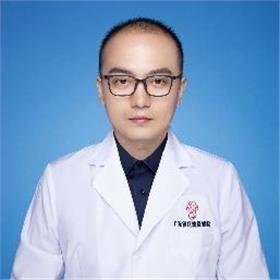

<!-- AUTO-GENERATED-BY: work/generate_obsidian_profiles.py -->

<!-- TEMPLATE: D:\workspace\信息收集整理\医生画像仓库\模板\医生画像模板.md -->

# 赵哲成

## 基础信息

| 字段 | 内容 |
|---|---|
| 姓名 | 赵哲成 |
| 医院 | 广东省妇幼保健院 |
| 科室 | 耳鼻咽喉头颈外科、儿童过敏多学科联合（番禺院区、越秀院区） |
| 职称/身份 | 副主任医师 |
| 来源链接 | [官网原文](https://www.e3861.com/keshizhuanjia/zhuanjiajieshao/32794.html) |
| 采集日期 | 2026-08-14 |

## 简介/擅长

成人及儿童变应性鼻炎，鼻窦炎，鼻腔肿瘤病变的系统性治疗，儿童及成人鼾症的系统性治疗，头颈肿瘤及中中耳炎，鼻面部肿瘤切除皮瓣修复手术，各类耳聋及眩晕等治疗。

## 教育与进修经历

- 副主任医师，医学硕士，毕业于中南大学湘雅医学院，于中山大大学附属第一医院耳鼻咽喉科进修学习。

## 科研项目与成果

- 科研成果：于国内外期刊发表论文数篇，第二主编专著一部

## 论文与学术产出

- 科研成果：于国内外期刊发表论文数篇，第二主编专著一部

## 可包装亮点

- 副主任医师，医学硕士，毕业于中南大学湘雅医学院，于中山大大学附属第一医院耳鼻咽喉科进修学习。
- 现社会任职：广东省医学教育协会儿童耳鼻咽喉专业委员会常委广东省药学会变态反应学会委员 中国优生科学协会儿童变态反应分会委员 擅长：成人及儿童变应性鼻炎，鼻窦炎，鼻腔肿瘤病变的系统性治疗，儿童及成人鼾症的系统性治疗，头颈肿瘤及中中耳炎，鼻面部肿瘤切除皮瓣修复手术，各类耳聋及眩晕等治疗。
- 科研成果：于国内外期刊发表论文数篇，第二主编专著一部

## 重点疾病/人群标签

- 慢性病：
- 肿瘤：肿瘤、多学科
- 生殖疾病：
- 免疫/风湿：
- 术后恢复/康复：
- 疑难重症：肿瘤、多学科

## 证据摘录

> 只摘录官网公开信息中的短句或关键字段，不复制大段原文。

- 官网身份字段：副主任医师
- 官网简介/擅长：成人及儿童变应性鼻炎，鼻窦炎，鼻腔肿瘤病变的系统性治疗，儿童及成人鼾症的系统性治疗，头颈肿瘤及中中耳炎，鼻面部肿瘤切除皮瓣修复手术，各类耳聋及眩晕等治疗。
- 官网亮眼经历线索：副主任医师，医学硕士，毕业于中南大学湘雅医学院，于中山大大学附属第一医院耳鼻咽喉科进修学习。 现社会任职：广东省医学教育协会儿童耳鼻咽喉专业委员会常委广东省药学会变态反应学会委员 中国优生科学协会儿童变态反应分会委员 擅长：成人及儿童变应性鼻炎，鼻窦炎，鼻腔肿瘤病变的系统性治疗，儿童及成人鼾症的系统性治疗，头颈肿瘤及中中耳炎，鼻面部肿瘤切除皮瓣修复手术，各类耳聋及眩晕等治疗。 科研成果：于国内外期刊发表论文数篇，第二主编专著一部
- 来源链接：https://www.e3861.com/keshizhuanjia/zhuanjiajieshao/32794.html

## BD 画像摘要

赵哲成医生可作为肿瘤、疑难重症方向的基础画像候选。后续 BD 使用应继续以官网来源和人工复核为准，不添加疗效承诺或无来源包装。

## 合规边界

- 仅使用医院官网、官方公众号、官方小程序等公开渠道。
- 不采集私人电话、私人微信、家庭住址、患者隐私或非公开排班信息。
- 不写“保证治愈”“疗效第一”“包治疑难杂症”等无法由官网证明的表述。
