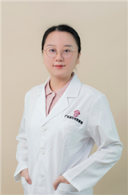

<!-- AUTO-GENERATED-BY: work/generate_obsidian_profiles.py -->

<!-- TEMPLATE: D:\workspace\信息收集整理\医生画像仓库\模板\医生画像模板.md -->

# 邓智

## 基础信息

| 字段 | 内容 |
|---|---|
| 姓名 | 邓智 |
| 医院 | 广东省妇幼保健院 |
| 科室 | 儿童内分泌遗传代谢（番禺院区） |
| 职称/身份 | 主治医师 |
| 来源链接 | [官网原文](https://www.e3861.com/keshizhuanjia/zhuanjiajieshao/32594.html) |
| 采集日期 | 2026-08-14 |

## 简介/擅长

## 教育与进修经历

- 主治医师，儿科学硕士，毕业于广州医科大学。
- 曾赴上海复旦大学附属儿科医院（国家儿童医疗中心）内分泌遗传代谢科进修学习。

## 科研项目与成果

- 科研成果： 主要参与市级科研项目1项，发表SCI论文4篇，国内论文4篇

## 论文与学术产出

- 科研成果： 主要参与市级科研项目1项，发表SCI论文4篇，国内论文4篇

## 可包装亮点

- 曾赴上海复旦大学附属儿科医院（国家儿童医疗中心）内分泌遗传代谢科进修学习。
- 学术任职： 广东省精准医学应用学会儿童生长发育分会秘书 广东省卫生经济学会罕见病专业委员会委员 擅长领域： 擅长儿童内分泌疾病诊治：儿童体重管理与肥胖症诊治（高血压，高血脂，代谢综合征）；
- 科研成果： 主要参与市级科研项目1项，发表SCI论文4篇，国内论文4篇

## 重点疾病/人群标签

- 慢性病：高血压、糖尿病、代谢、罕见
- 肿瘤：
- 生殖疾病：
- 免疫/风湿：
- 术后恢复/康复：
- 疑难重症：高血压、糖尿病、代谢、罕见

## 证据摘录

> 只摘录官网公开信息中的短句或关键字段，不复制大段原文。

- 官网身份字段：主治医师
- 官网亮眼经历线索：曾赴上海复旦大学附属儿科医院（国家儿童医疗中心）内分泌遗传代谢科进修学习。 学术任职： 广东省精准医学应用学会儿童生长发育分会秘书 广东省卫生经济学会罕见病专业委员会委员 擅长领域： 擅长儿童内分泌疾病诊治：儿童体重管理与肥胖症诊治（高血压，高血脂，代谢综合征）； 科研成果： 主要参与市级科研项目1项，发表SCI论文4篇，国内论文4篇
- 来源链接：https://www.e3861.com/keshizhuanjia/zhuanjiajieshao/32594.html

## BD 画像摘要

邓智医生可作为慢性病、疑难重症方向的基础画像候选。后续 BD 使用应继续以官网来源和人工复核为准，不添加疗效承诺或无来源包装。

## 合规边界

- 仅使用医院官网、官方公众号、官方小程序等公开渠道。
- 不采集私人电话、私人微信、家庭住址、患者隐私或非公开排班信息。
- 不写“保证治愈”“疗效第一”“包治疑难杂症”等无法由官网证明的表述。
