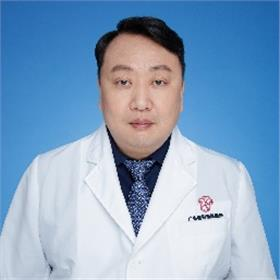

<!-- AUTO-GENERATED-BY: work/generate_obsidian_profiles.py -->

<!-- TEMPLATE: D:\workspace\信息收集整理\医生画像仓库\模板\医生画像模板.md -->

# 邹宇

## 基础信息

| 字段 | 内容 |
|---|---|
| 姓名 | 邹宇 |
| 医院 | 广东省妇幼保健院 |
| 科室 | 耳鼻咽喉头颈外科（番禺院区） |
| 职称/身份 | 主任医师 |
| 来源链接 | [官网原文](https://www.e3861.com/keshizhuanjia/zhuanjiajieshao/32445.html) |
| 采集日期 | 2026-08-14 |

## 简介/擅长

## 科研项目与成果

- 现任中国睡眠研究会儿童睡眠医学专业委员会常委，中国妇幼保健协会儿童变态反应专委会常委及儿童耳鼻咽喉组副组长，中国听力发展基金会儿童听力保健专委会常委，中国妇幼保健协会儿童耳鼻喉微创学组委员，中国医师协会儿童耳鼻咽喉专业委员会委员，广东省儿童耳鼻咽喉头颈外科专科联盟盟主，广东省妇幼保健协会儿童耳鼻咽喉疾病防治专业委员会主任委员，广东省医学会耳鼻喉分会小儿学组副组长，广东省防聋治聋技术指导组副组长，广东省医师协会听力言语及认知专委会副主任委员，广东省精准医学应用学会听觉与前庭障碍分会副主任委员，广东省残疾人康复协会听…
- 主持完成省级及厅局级课题4项。

## 论文与学术产出

- 以第一作者完成SCI及中文核心期刊论文数十篇，主编专著4本，副主编专著4本，参编1本。

## 可包装亮点

- 广东省妇幼保健院耳鼻咽喉头颈外科主任，博士，主任医师，教授。
- 现任中国睡眠研究会儿童睡眠医学专业委员会常委，中国妇幼保健协会儿童变态反应专委会常委及儿童耳鼻咽喉组副组长，中国听力发展基金会儿童听力保健专委会常委，中国妇幼保健协会儿童耳鼻喉微创学组委员，中国医师协会儿童耳鼻咽喉专业委员会委员，广东省儿童耳鼻咽喉头颈外科专科联盟盟主，广东省妇幼保健协会儿童耳鼻咽喉疾病防治专业委员会主任委员，广东省医学会耳鼻喉分会小儿学组…
- 以第一作者完成SCI及中文核心期刊论文数十篇，主编专著4本，副主编专著4本...

## 重点疾病/人群标签

- 慢性病：
- 肿瘤：
- 生殖疾病：
- 免疫/风湿：
- 术后恢复/康复：康复
- 疑难重症：

## 证据摘录

> 只摘录官网公开信息中的短句或关键字段，不复制大段原文。

- 官网身份字段：主任医师
- 官网亮眼经历线索：广东省妇幼保健院耳鼻咽喉头颈外科主任，博士，主任医师，教授。 现任中国睡眠研究会儿童睡眠医学专业委员会常委，中国妇幼保健协会儿童变态反应专委会常委及儿童耳鼻咽喉组副组长，中国听力发展基金会儿童听力保健专委会常委，中国妇幼保健协会儿童耳鼻喉微创学组委员，中国医师协会儿童耳鼻咽喉专业委员会委员，广东省儿童耳鼻咽喉头颈外科专科联盟盟主，广东省妇幼保健协会儿童耳鼻咽喉疾病防治专业委员会主任委员，广东省医学会耳鼻喉分会小儿学组副组长，广东省防聋…
- 来源链接：https://www.e3861.com/keshizhuanjia/zhuanjiajieshao/32445.html

## BD 画像摘要

邹宇医生可作为术后恢复/康复方向的基础画像候选。后续 BD 使用应继续以官网来源和人工复核为准，不添加疗效承诺或无来源包装。

## 合规边界

- 仅使用医院官网、官方公众号、官方小程序等公开渠道。
- 不采集私人电话、私人微信、家庭住址、患者隐私或非公开排班信息。
- 不写“保证治愈”“疗效第一”“包治疑难杂症”等无法由官网证明的表述。
