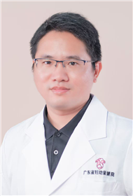

<!-- AUTO-GENERATED-BY: work/generate_obsidian_profiles.py -->

<!-- TEMPLATE: D:\workspace\信息收集整理\医生画像仓库\模板\医生画像模板.md -->

# 郑少章

## 基础信息

| 字段 | 内容 |
|---|---|
| 姓名 | 郑少章 |
| 医院 | 广东省妇幼保健院 |
| 科室 | 儿科（越秀院区） |
| 职称/身份 | 主治医师 |
| 来源链接 | [官网原文](https://www.e3861.com/keshizhuanjia/zhuanjiajieshao/32700.html) |
| 采集日期 | 2026-08-14 |

## 简介/擅长

## 教育与进修经历

- 主治医师，毕业于广州医科大学，临床医学学士 专业特长： 从事儿科临床工作十余年，擅长儿童呼吸系统疾病、消化系统疾病、感染性疾病及危重症救治，熟练掌握儿童支气管镜操作。
- 曾赴浙江大学医学院附属儿童医院进修学习，取得儿童支气管镜操作四级证书。
- 社会任职： 广东省健康科普促进会儿科分会常委 广东省医药质量管理协会儿科门诊规范诊疗专业委员会委员 中国医师协会住院医师规范化培训教师

## 论文与学术产出

- 获奖情况： 发表专业论文及科普作品多篇，获2024年金声玉振病例演讲比赛广东省决赛二等奖。

## 可包装亮点

- 主治医师，毕业于广州医科大学，临床医学学士 专业特长： 从事儿科临床工作十余年，擅长儿童呼吸系统疾病、消化系统疾病、感染性疾病及危重症救治，熟练掌握儿童支气管镜操作。
- 曾赴浙江大学医学院附属儿童医院进修学习，取得儿童支气管镜操作四级证书。
- 获奖情况： 发表专业论文及科普作品多篇，获2024年金声玉振病例演讲比赛广东省决赛二等奖。
- 2023年“儿童之星”医学科普演讲大赛东南赛区一等奖、全国总决赛三等奖。

## 重点疾病/人群标签

- 慢性病：
- 肿瘤：
- 生殖疾病：
- 免疫/风湿：感染、危重
- 术后恢复/康复：
- 疑难重症：感染、危重

## 证据摘录

> 只摘录官网公开信息中的短句或关键字段，不复制大段原文。

- 官网身份字段：主治医师
- 官网亮眼经历线索：主治医师，毕业于广州医科大学，临床医学学士 专业特长： 从事儿科临床工作十余年，擅长儿童呼吸系统疾病、消化系统疾病、感染性疾病及危重症救治，熟练掌握儿童支气管镜操作。 曾赴浙江大学医学院附属儿童医院进修学习，取得儿童支气管镜操作四级证书。 获奖情况： 发表专业论文及科普作品多篇，获2024年金声玉振病例演讲比赛广东省决赛二等奖。 2023年“儿童之星”医学科普演讲大赛东南赛区一等奖、全国总决赛三等奖。
- 来源链接：https://www.e3861.com/keshizhuanjia/zhuanjiajieshao/32700.html

## BD 画像摘要

郑少章医生可作为免疫/风湿/感染、疑难重症方向的基础画像候选。后续 BD 使用应继续以官网来源和人工复核为准，不添加疗效承诺或无来源包装。

## 合规边界

- 仅使用医院官网、官方公众号、官方小程序等公开渠道。
- 不采集私人电话、私人微信、家庭住址、患者隐私或非公开排班信息。
- 不写“保证治愈”“疗效第一”“包治疑难杂症”等无法由官网证明的表述。
