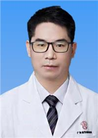

<!-- AUTO-GENERATED-BY: work/generate_obsidian_profiles.py -->

<!-- TEMPLATE: D:\workspace\信息收集整理\医生画像仓库\模板\医生画像模板.md -->

# 郑毅春

## 基础信息

| 字段 | 内容 |
|---|---|
| 姓名 | 郑毅春 |
| 医院 | 广东省妇幼保健院 |
| 科室 | 生殖健康与不孕症科（番禺院区、越秀院区、天河院区） |
| 职称/身份 | 主任中医师 |
| 来源链接 | [官网原文](https://www.e3861.com/keshizhuanjia/zhuanjiajieshao/32436.html) |
| 采集日期 | 2026-08-14 |

## 简介/擅长

擅长男性婚前、育前检查咨询、调理，以及中西医结合治疗男性少、弱、畸精子症、免疫性不育、男性性功能障碍及前列腺疾病等。

## 论文与学术产出

- 发表论文30余篇，SCI3篇，著作5部；

## 可包装亮点

- 医学博士 学术任职：中国性学会妇幼保健男科分会委员、广东省健康管理学会男性健康专业委员会常务委员、广东省中医药学会生殖医学专业委员会委员等；
- 发表论文30余篇，SCI3篇，著作5部；

## 重点疾病/人群标签

- 慢性病：
- 肿瘤：
- 生殖疾病：生殖、不孕、免疫、功能障碍
- 免疫/风湿：生殖、不孕、免疫、功能障碍
- 术后恢复/康复：生殖、不孕、免疫、功能障碍
- 疑难重症：

## 证据摘录

> 只摘录官网公开信息中的短句或关键字段，不复制大段原文。

- 官网身份字段：主任中医师
- 官网简介/擅长：擅长男性婚前、育前检查咨询、调理，以及中西医结合治疗男性少、弱、畸精子症、免疫性不育、男性性功能障碍及前列腺疾病等。
- 官网亮眼经历线索：医学博士 学术任职：中国性学会妇幼保健男科分会委员、广东省健康管理学会男性健康专业委员会常务委员、广东省中医药学会生殖医学专业委员会委员等； 发表论文30余篇，SCI3篇，著作5部；
- 来源链接：https://www.e3861.com/keshizhuanjia/zhuanjiajieshao/32436.html

## BD 画像摘要

郑毅春医生可作为生殖疾病、免疫/风湿/感染、术后恢复/康复方向的基础画像候选。后续 BD 使用应继续以官网来源和人工复核为准，不添加疗效承诺或无来源包装。

## 合规边界

- 仅使用医院官网、官方公众号、官方小程序等公开渠道。
- 不采集私人电话、私人微信、家庭住址、患者隐私或非公开排班信息。
- 不写“保证治愈”“疗效第一”“包治疑难杂症”等无法由官网证明的表述。
