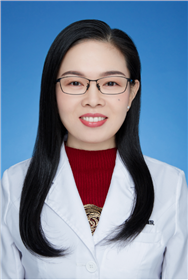

<!-- AUTO-GENERATED-BY: work/generate_obsidian_profiles.py -->

<!-- TEMPLATE: D:\workspace\信息收集整理\医生画像仓库\模板\医生画像模板.md -->

# 郭良芬

## 基础信息

| 字段 | 内容 |
|---|---|
| 姓名 | 郭良芬 |
| 医院 | 广东省妇幼保健院 |
| 科室 | 耳鼻咽喉头颈外科（番禺院区、越秀院区） |
| 职称/身份 | 主任医师 |
| 来源链接 | [官网原文](https://www.e3861.com/keshizhuanjia/zhuanjiajieshao/32796.html) |
| 采集日期 | 2026-08-14 |

## 简介/擅长

## 教育与进修经历

- 中西医结合主任医师，硕士，毕业于广州中医药大学，深耕耳鼻喉科临床二十余年，始终坚持以患者为中心，专注儿童及成人耳鼻喉疾病的个体化诊疗，凭借中西医结合特色疗法，为众多患者实现标本兼治。

## 科研项目与成果

- 科研与科普成果： 主持或参与多项省级科研项目，获授权《中药熏鼻治疗仪》《一种测耳装置》《一种鼻腔止血海绵》《包装盒》4项国家专利。

## 可包装亮点

- 中西医结合主任医师，硕士，毕业于广州中医药大学，深耕耳鼻喉科临床二十余年，始终坚持以患者为中心，专注儿童及成人耳鼻喉疾病的个体化诊疗，凭借中西医结合特色疗法，为众多患者实现标本兼治。
- 专业擅长： 针对急慢性中耳炎、过敏性鼻炎、鼻窦炎、小儿鼾症（腺样体及扁桃体肥大）、慢性扁桃体炎、咽喉炎、鼻源性/喉源性咳嗽、耳前瘘管及副耳等疾病，根据患者体质、病情分期及症状特点，定制“一人一方”的中西医结合诊疗方案，既发挥西医精准干预的优势，又融合中医整体调理、减少复发的长处，疗效显著。
- 同时擅长婴儿耳廓无创矫正技术，为耳廓形态畸形患儿提供无创、精准的矫正治疗；
- 现任世界中医药联合会耳鼻喉口腔科专业委员会理事、中华中医药学会耳鼻喉科分会委员、中国妇幼保健协会耳鼻咽喉疾病防治专业委员会委员、广东省中西医结合学会耳鼻咽喉科专业委员会常委等多项重要学术职务，2022年荣获“羊城好医生”荣誉称号。

## 重点疾病/人群标签

- 慢性病：慢性、术后、恢复
- 肿瘤：
- 生殖疾病：
- 免疫/风湿：
- 术后恢复/康复：慢性、术后、恢复
- 疑难重症：

## 证据摘录

> 只摘录官网公开信息中的短句或关键字段，不复制大段原文。

- 官网身份字段：主任医师
- 官网亮眼经历线索：中西医结合主任医师，硕士，毕业于广州中医药大学，深耕耳鼻喉科临床二十余年，始终坚持以患者为中心，专注儿童及成人耳鼻喉疾病的个体化诊疗，凭借中西医结合特色疗法，为众多患者实现标本兼治。 专业擅长： 针对急慢性中耳炎、过敏性鼻炎、鼻窦炎、小儿鼾症（腺样体及扁桃体肥大）、慢性扁桃体炎、咽喉炎、鼻源性/喉源性咳嗽、耳前瘘管及副耳等疾病，根据患者体质、病情分期及症状特点，定制“一人一方”的中西医结合诊疗方案，既发挥西医精准干预的优势，又融合中医…
- 来源链接：https://www.e3861.com/keshizhuanjia/zhuanjiajieshao/32796.html

## BD 画像摘要

郭良芬医生可作为慢性病、术后恢复/康复方向的基础画像候选。后续 BD 使用应继续以官网来源和人工复核为准，不添加疗效承诺或无来源包装。

## 合规边界

- 仅使用医院官网、官方公众号、官方小程序等公开渠道。
- 不采集私人电话、私人微信、家庭住址、患者隐私或非公开排班信息。
- 不写“保证治愈”“疗效第一”“包治疑难杂症”等无法由官网证明的表述。
