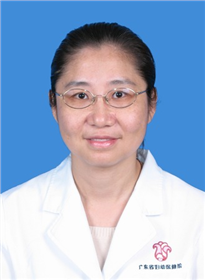

<!-- AUTO-GENERATED-BY: work/generate_obsidian_profiles.py -->

<!-- TEMPLATE: D:\workspace\信息收集整理\医生画像仓库\模板\医生画像模板.md -->

# 陈凤媚

## 基础信息

| 字段 | 内容 |
|---|---|
| 姓名 | 陈凤媚 |
| 医院 | 广东省妇幼保健院 |
| 科室 | 中医科（番禺院区） |
| 职称/身份 | 主任中医师 |
| 来源链接 | [官网原文](https://www.e3861.com/keshizhuanjia/zhuanjiajieshao/32439.html) |
| 采集日期 | 2026-08-14 |

## 简介/擅长

## 教育与进修经历

- 个人简介： 毕业于广州中医药大学。

## 科研项目与成果

- 科研成果 已发表专业论文60余篇，参与科研课题9项，主持科研课题2项，主编著作1本，副主编1本。

## 论文与学术产出

- 科研成果 已发表专业论文60余篇，参与科研课题9项，主持科研课题2项，主编著作1本，副主编1本。

## 可包装亮点

- 中医科学术带头人，任广东省中西医结合学会儿科专业委员会常务委员、广东省中医药学会儿科分会委员、妇幼健康研究会中医药发展专业委员会常务委员 擅长领域： 从事中医科工作40年, 擅长妇女儿童常见疾病的中医治疗和妇幼健康的中医调理。
- 科研成果 已发表专业论文60余篇，参与科研课题9项，主持科研课题2项，主编著作1本，副主编1本。

## 重点疾病/人群标签

- 慢性病：
- 肿瘤：
- 生殖疾病：胚胎、月经、感染
- 免疫/风湿：胚胎、月经、感染
- 术后恢复/康复：
- 疑难重症：

## 证据摘录

> 只摘录官网公开信息中的短句或关键字段，不复制大段原文。

- 官网身份字段：主任中医师
- 官网亮眼经历线索：中医科学术带头人，任广东省中西医结合学会儿科专业委员会常务委员、广东省中医药学会儿科分会委员、妇幼健康研究会中医药发展专业委员会常务委员 擅长领域： 从事中医科工作40年, 擅长妇女儿童常见疾病的中医治疗和妇幼健康的中医调理。 科研成果 已发表专业论文60余篇，参与科研课题9项，主持科研课题2项，主编著作1本，副主编1本。
- 来源链接：https://www.e3861.com/keshizhuanjia/zhuanjiajieshao/32439.html

## BD 画像摘要

陈凤媚医生可作为生殖疾病、免疫/风湿/感染方向的基础画像候选。后续 BD 使用应继续以官网来源和人工复核为准，不添加疗效承诺或无来源包装。

## 合规边界

- 仅使用医院官网、官方公众号、官方小程序等公开渠道。
- 不采集私人电话、私人微信、家庭住址、患者隐私或非公开排班信息。
- 不写“保证治愈”“疗效第一”“包治疑难杂症”等无法由官网证明的表述。
