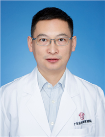

<!-- AUTO-GENERATED-BY: work/generate_obsidian_profiles.py -->

<!-- TEMPLATE: D:\workspace\信息收集整理\医生画像仓库\模板\医生画像模板.md -->

# 陈曦

## 基础信息

| 字段 | 内容 |
|---|---|
| 姓名 | 陈曦 |
| 医院 | 广东省妇幼保健院 |
| 科室 | 耳鼻咽喉头颈外科、儿童过敏多学科联合（番禺院区） |
| 职称/身份 | 主任医师 |
| 来源链接 | [官网原文](https://www.e3861.com/keshizhuanjia/zhuanjiajieshao/32797.html) |
| 采集日期 | 2026-08-14 |

## 简介/擅长

## 教育与进修经历

- 耳鼻喉科副主任，主任医师，博士研究生，毕业于中山大学，德国纽伦堡医院访问学者，先后在中山大学附属第一医院学习及广州市妇女儿童医疗中心工作。

## 科研项目与成果

- 科研成果 ：目前以第一作者在国际期刊发表论文 5 篇，国内本专业核心期刊发表论文十余篇，参编《临床小儿耳鼻喉疾病诊疗学》及《现代耳鼻咽喉头颈外科疾病临床诊疗学》等专著，主持完成省级及厅局级课题 3 项。

## 论文与学术产出

- 科研成果 ：目前以第一作者在国际期刊发表论文 5 篇，国内本专业核心期刊发表论文十余篇，参编《临床小儿耳鼻喉疾病诊疗学》及《现代耳鼻咽喉头颈外科疾病临床诊疗学》等专著，主持完成省级及厅局级课题 3 项。

## 可包装亮点

- 耳鼻喉科副主任，主任医师，博士研究生，毕业于中山大学，德国纽伦堡医院访问学者，先后在中山大学附属第一医院学习及广州市妇女儿童医疗中心工作。
- 现任广东省医疗行业协会耳鼻喉头颈外科管理委员会常委，广东省预防医学会耳鼻喉专业委员会常委，广东省健康管理学会耳鼻咽喉专业委员会委员等多个专业学术组织职务。
- 科研成果 ：目前以第一作者在国际期刊发表论文 5 篇，国内本专业核心期刊发表论文十余篇，参编《临床小儿耳鼻喉疾病诊疗学》及《现代耳鼻咽喉头颈外科疾病临床诊疗学》等专著，主持完成省级及厅局级课题 3 项。

## 重点疾病/人群标签

- 慢性病：
- 肿瘤：
- 生殖疾病：
- 免疫/风湿：
- 术后恢复/康复：
- 疑难重症：多学科

## 证据摘录

> 只摘录官网公开信息中的短句或关键字段，不复制大段原文。

- 官网身份字段：主任医师
- 官网亮眼经历线索：耳鼻喉科副主任，主任医师，博士研究生，毕业于中山大学，德国纽伦堡医院访问学者，先后在中山大学附属第一医院学习及广州市妇女儿童医疗中心工作。 现任广东省医疗行业协会耳鼻喉头颈外科管理委员会常委，广东省预防医学会耳鼻喉专业委员会常委，广东省健康管理学会耳鼻咽喉专业委员会委员等多个专业学术组织职务。 科研成果 ：目前以第一作者在国际期刊发表论文 5 篇，国内本专业核心期刊发表论文十余篇，参编《临床小儿耳鼻喉疾病诊疗学》及《现代耳鼻咽喉头颈外…
- 来源链接：https://www.e3861.com/keshizhuanjia/zhuanjiajieshao/32797.html

## BD 画像摘要

陈曦医生可作为疑难重症方向的基础画像候选。后续 BD 使用应继续以官网来源和人工复核为准，不添加疗效承诺或无来源包装。

## 合规边界

- 仅使用医院官网、官方公众号、官方小程序等公开渠道。
- 不采集私人电话、私人微信、家庭住址、患者隐私或非公开排班信息。
- 不写“保证治愈”“疗效第一”“包治疑难杂症”等无法由官网证明的表述。
