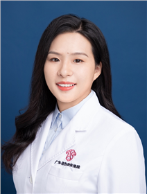

<!-- AUTO-GENERATED-BY: work/generate_obsidian_profiles.py -->

<!-- TEMPLATE: D:\workspace\信息收集整理\医生画像仓库\模板\医生画像模板.md -->

# 陈永秀

## 基础信息

| 字段 | 内容 |
|---|---|
| 姓名 | 陈永秀 |
| 医院 | 广东省妇幼保健院 |
| 科室 | 妇科（番禺院区） |
| 职称/身份 | 副主任医师 |
| 来源链接 | [官网原文](https://www.e3861.com/keshizhuanjia/zhuanjiajieshao/32850.html) |
| 采集日期 | 2026-08-14 |

## 简介/擅长

## 可包装亮点

- 副主任医师，硕士研究生导师 专业专长： 妇科泌尿及女性盆底功能障碍性疾病：尿失禁、盆腔器官脱垂（如子宫/阴道脱垂）、阴道松弛、膀胱阴道瘘、女性私密生殖整复、子宫肌瘤、卵巢囊肿等疾病的无创、微创手术治疗；
- 获得2024年“北大盆底新星手术视频大赛”一等奖。
- 学术任职： 中国性学会性医学分会常委 中国整形美容协会生殖整复分会理事 广东省精准医学女性盆底疾病分会常委 广东省泌尿生殖协会盆底学分会常委 广东省中医药学会盆底医学分会常委 广东省基层医药学会妇科专委会常委 广东省医师协会妇科内镜医师分会委员 广东省妇幼保健协会阴式手术与盆底疾病分会委员 广东省预防医学会盆底功能障碍防治专业委员会委员 广东省整形美容协会…

## 重点疾病/人群标签

- 慢性病：
- 肿瘤：瘤、生殖、卵巢、术后、恢复、功能障碍
- 生殖疾病：瘤、生殖、卵巢、术后、恢复、功能障碍
- 免疫/风湿：
- 术后恢复/康复：瘤、生殖、卵巢、术后、恢复、功能障碍
- 疑难重症：

## 证据摘录

> 只摘录官网公开信息中的短句或关键字段，不复制大段原文。

- 官网身份字段：副主任医师
- 官网亮眼经历线索：副主任医师，硕士研究生导师 专业专长： 妇科泌尿及女性盆底功能障碍性疾病：尿失禁、盆腔器官脱垂（如子宫/阴道脱垂）、阴道松弛、膀胱阴道瘘、女性私密生殖整复、子宫肌瘤、卵巢囊肿等疾病的无创、微创手术治疗； 获得2024年“北大盆底新星手术视频大赛”一等奖。 学术任职： 中国性学会性医学分会常委 中国整形美容协会生殖整复分会理事 广东省精准医学女性盆底疾病分会常委 广东省泌尿生殖协会盆底学分会常委 广东省中医药学会盆底医学分会常委 广东省…
- 来源链接：https://www.e3861.com/keshizhuanjia/zhuanjiajieshao/32850.html

## BD 画像摘要

陈永秀医生可作为肿瘤、生殖疾病、术后恢复/康复方向的基础画像候选。后续 BD 使用应继续以官网来源和人工复核为准，不添加疗效承诺或无来源包装。

## 合规边界

- 仅使用医院官网、官方公众号、官方小程序等公开渠道。
- 不采集私人电话、私人微信、家庭住址、患者隐私或非公开排班信息。
- 不写“保证治愈”“疗效第一”“包治疑难杂症”等无法由官网证明的表述。
