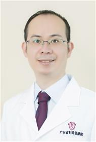

<!-- AUTO-GENERATED-BY: work/generate_obsidian_profiles.py -->

<!-- TEMPLATE: D:\workspace\信息收集整理\医生画像仓库\模板\医生画像模板.md -->

# 陈胡林

## 基础信息

| 字段 | 内容 |
|---|---|
| 姓名 | 陈胡林 |
| 医院 | 广东省妇幼保健院 |
| 科室 | 皮肤性病科、儿童过敏多学科联合（番禺院区、越秀院区） |
| 职称/身份 | 副主任医师 |
| 来源链接 | [官网原文](https://www.e3861.com/keshizhuanjia/zhuanjiajieshao/32616.html) |
| 采集日期 | 2026-08-14 |

## 简介/擅长

1.儿童和孕妇皮肤病，如湿疹、特应性皮炎、荨麻疹、癣、妊娠相关性皮炎、过敏性皮炎、脂溢性皮炎、虫咬皮炎等。2.皮肤光电、果酸治疗与注射美容，如腋臭、痤疮、白癜风、皮肤胎记、面部皱纹、疤痕、妊娠纹等。3.感染性及风湿免疫皮肤病诊疗，如病毒性疣、传染性软疣、红斑狼疮等。4.各类性病综合治疗，如淋病、尖锐湿疣、疱疹、梅毒等。

## 可包装亮点

- 社会任职：广东省医学美容学会皮肤美容分会常委，广州市医师协会激光美容与整形专业医师分会委员，广东省整形美容协会青年委员会委员。

## 重点疾病/人群标签

- 慢性病：
- 肿瘤：
- 生殖疾病：
- 免疫/风湿：风湿、免疫、感染、红斑狼疮、多学科
- 术后恢复/康复：
- 疑难重症：风湿、免疫、感染、红斑狼疮、多学科

## 证据摘录

> 只摘录官网公开信息中的短句或关键字段，不复制大段原文。

- 官网身份字段：副主任医师
- 官网简介/擅长：1.儿童和孕妇皮肤病，如湿疹、特应性皮炎、荨麻疹、癣、妊娠相关性皮炎、过敏性皮炎、脂溢性皮炎、虫咬皮炎等。2.皮肤光电、果酸治疗与注射美容，如腋臭、痤疮、白癜风、皮肤胎记、面部皱纹、疤痕、妊娠纹等。3.感染性及风湿免疫皮肤病诊疗，如病毒性疣、传染性软疣、红斑狼疮等。4.各类性病综合治疗，如淋病、尖锐湿疣、疱疹、梅毒等。
- 官网亮眼经历线索：社会任职：广东省医学美容学会皮肤美容分会常委，广州市医师协会激光美容与整形专业医师分会委员，广东省整形美容协会青年委员会委员。
- 来源链接：https://www.e3861.com/keshizhuanjia/zhuanjiajieshao/32616.html

## BD 画像摘要

陈胡林医生可作为免疫/风湿/感染、疑难重症方向的基础画像候选。后续 BD 使用应继续以官网来源和人工复核为准，不添加疗效承诺或无来源包装。

## 合规边界

- 仅使用医院官网、官方公众号、官方小程序等公开渠道。
- 不采集私人电话、私人微信、家庭住址、患者隐私或非公开排班信息。
- 不写“保证治愈”“疗效第一”“包治疑难杂症”等无法由官网证明的表述。
