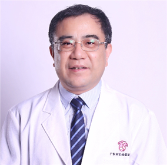

<!-- AUTO-GENERATED-BY: work/generate_obsidian_profiles.py -->

<!-- TEMPLATE: D:\workspace\信息收集整理\医生画像仓库\模板\医生画像模板.md -->

# 陈运彬

## 基础信息

| 字段 | 内容 |
|---|---|
| 姓名 | 陈运彬 |
| 医院 | 广东省妇幼保健院 |
| 科室 | 普通儿科、新生儿科（越秀院区） |
| 职称/身份 | 主任医师 |
| 来源链接 | [官网原文](https://www.e3861.com/keshizhuanjia/zhuanjiajieshao/33006.html) |
| 采集日期 | 2026-08-14 |

## 简介/擅长

## 可包装亮点

- 陈运彬（儿科）名医工作室依托我院国家医学重点专科（新生儿科）、国家新生儿保健特色专科、广东省高水平临床重点专科（新生儿科、儿童保健科、小儿外科）建立，专家中拥有众多儿科“岭南名医”、广东省杰出青年医学人才、中国白求恩式好医生、广东省医师奖、全国卫生计生系统先进工作者获得者及南粤好医生”、“羊城好医生、广东实力中青年医生，团队成员曾先后获得中国宋庆龄儿科医学…
- 团队多名专家在中华医学会、中国医师协会、中国妇幼保健协会担任相关儿科专业主委、常委，是广东省医学会、广东省医师协会、广东省妇幼保健协会儿科专业的主任委员单位，引领广东省围产医学、儿科、儿童...

## 重点疾病/人群标签

- 慢性病：代谢、免疫、感染、康复、营养、重症
- 肿瘤：
- 生殖疾病：
- 免疫/风湿：代谢、免疫、感染、康复、营养、重症
- 术后恢复/康复：代谢、免疫、感染、康复、营养、重症
- 疑难重症：代谢、免疫、感染、康复、营养、重症

## 证据摘录

> 只摘录官网公开信息中的短句或关键字段，不复制大段原文。

- 官网身份字段：主任医师
- 官网亮眼经历线索：陈运彬（儿科）名医工作室依托我院国家医学重点专科（新生儿科）、国家新生儿保健特色专科、广东省高水平临床重点专科（新生儿科、儿童保健科、小儿外科）建立，专家中拥有众多儿科“岭南名医”、广东省杰出青年医学人才、中国白求恩式好医生、广东省医师奖、全国卫生计生系统先进工作者获得者及南粤好医生”、“羊城好医生、广东实力中青年医生，团队成员曾先后获得中国宋庆龄儿科医学奖、广东省科学技术奖二等奖、三等奖，广东省科技进步奖二等奖，中华预防医学奖三等奖…
- 来源链接：https://www.e3861.com/keshizhuanjia/zhuanjiajieshao/33006.html

## BD 画像摘要

陈运彬医生可作为慢性病、免疫/风湿/感染、术后恢复/康复、疑难重症方向的基础画像候选。后续 BD 使用应继续以官网来源和人工复核为准，不添加疗效承诺或无来源包装。

## 合规边界

- 仅使用医院官网、官方公众号、官方小程序等公开渠道。
- 不采集私人电话、私人微信、家庭住址、患者隐私或非公开排班信息。
- 不写“保证治愈”“疗效第一”“包治疑难杂症”等无法由官网证明的表述。
