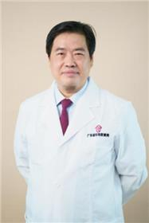

<!-- AUTO-GENERATED-BY: work/generate_obsidian_profiles.py -->

<!-- TEMPLATE: D:\workspace\信息收集整理\医生画像仓库\模板\医生画像模板.md -->

# 韦相才

## 基础信息

| 字段 | 内容 |
|---|---|
| 姓名 | 韦相才 |
| 医院 | 广东省妇幼保健院 |
| 科室 | 妇科（番禺院区） |
| 职称/身份 | 主任医师 |
| 来源链接 | [官网原文](https://www.e3861.com/keshizhuanjia/zhuanjiajieshao/32511.html) |
| 采集日期 | 2026-08-14 |

## 简介/擅长

## 科研项目与成果

- 承担国家自然科学基金、国家科技支撑项目以及省部级课题20余项，发表文章近100篇，主编《生殖免疫学理论和临床新进展》（科学出版社，2015年）、副主编《复发性流产》（广东省科技出版社，2014年）著作2部。

## 论文与学术产出

- 承担国家自然科学基金、国家科技支撑项目以及省部级课题20余项，发表文章近100篇，主编《生殖免疫学理论和临床新进展》（科学出版社，2015年）、副主编《复发性流产》（广东省科技出版社，2014年）著作2部。

## 可包装亮点

- 副院长，医学博士，生殖医学主任医师，妇产科学教授，博士导师。
- 中国妇幼健康研究会常务理事兼生殖免疫专委会主任委员，中国妇幼健康研究会生殖免疫专科联盟理事长，广东省医学会生殖免疫与优生学分会主任委员，广东省免疫学会副理事长兼生殖免疫专委会主任委员；
- 广东省优生优育协会副会长兼生殖调节专业委员会主任委员，广东省遗传医学会常务理事；
- 广东省医学会遗传学会常务委员。

## 重点疾病/人群标签

- 慢性病：
- 肿瘤：
- 生殖疾病：生殖、不孕、卵巢、胚胎、多囊、免疫
- 免疫/风湿：生殖、不孕、卵巢、胚胎、多囊、免疫
- 术后恢复/康复：
- 疑难重症：

## 证据摘录

> 只摘录官网公开信息中的短句或关键字段，不复制大段原文。

- 官网身份字段：主任医师
- 官网亮眼经历线索：副院长，医学博士，生殖医学主任医师，妇产科学教授，博士导师。 中国妇幼健康研究会常务理事兼生殖免疫专委会主任委员，中国妇幼健康研究会生殖免疫专科联盟理事长，广东省医学会生殖免疫与优生学分会主任委员，广东省免疫学会副理事长兼生殖免疫专委会主任委员； 广东省优生优育协会副会长兼生殖调节专业委员会主任委员，广东省遗传医学会常务理事； 广东省医学会遗传学会常务委员。
- 来源链接：https://www.e3861.com/keshizhuanjia/zhuanjiajieshao/32511.html

## BD 画像摘要

韦相才医生可作为生殖疾病、免疫/风湿/感染方向的基础画像候选。后续 BD 使用应继续以官网来源和人工复核为准，不添加疗效承诺或无来源包装。

## 合规边界

- 仅使用医院官网、官方公众号、官方小程序等公开渠道。
- 不采集私人电话、私人微信、家庭住址、患者隐私或非公开排班信息。
- 不写“保证治愈”“疗效第一”“包治疑难杂症”等无法由官网证明的表述。
