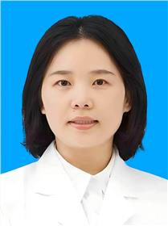

<!-- AUTO-GENERATED-BY: work/generate_obsidian_profiles.py -->

<!-- TEMPLATE: D:\workspace\信息收集整理\医生画像仓库\模板\医生画像模板.md -->

# 马颖

## 基础信息

| 字段 | 内容 |
|---|---|
| 姓名 | 马颖 |
| 医院 | 广东省妇幼保健院 |
| 科室 | 儿童保健科、儿童过敏多学科联合（番禺院区、天河院区） |
| 职称/身份 | 主任医师 |
| 来源链接 | [官网原文](https://www.e3861.com/keshizhuanjia/zhuanjiajieshao/33219.html) |
| 采集日期 | 2026-08-14 |

## 简介/擅长

## 科研项目与成果

- 研究方向： 儿童青少年生长发育和情绪行为问题的影响因素和脑神经机制探索，主持及参与国家、省、市课题多项，发表SCI及核心期刊论文多篇。

## 论文与学术产出

- 研究方向： 儿童青少年生长发育和情绪行为问题的影响因素和脑神经机制探索，主持及参与国家、省、市课题多项，发表SCI及核心期刊论文多篇。

## 可包装亮点

- 主任医师，广州市卫生健康委员会优秀人才 广州医科大学公共卫生学院硕士研究生导师 广东省康复医学会儿童脑病整合康复分会常务理事 广州市医学会疫苗不良反应精准整治学分会常务委员 广东省卫生统计学会儿童健康专委会委员 广东省妇幼保健协会儿童保健专业委员会委员 专业特长 ：儿童生长发育监测和偏离防治，儿童营养喂养咨询指导，儿童睡眠问题矫正，儿童发育行为问题早期干预。
- 研究方向： 儿童青少年生长发育和情绪行为问题的影响因素和脑神经机制探索，主持及参与国家、省、市课题多项，发表SCI及核心期刊论文多篇。

## 重点疾病/人群标签

- 慢性病：
- 肿瘤：
- 生殖疾病：
- 免疫/风湿：
- 术后恢复/康复：康复、营养、多学科
- 疑难重症：康复、营养、多学科

## 证据摘录

> 只摘录官网公开信息中的短句或关键字段，不复制大段原文。

- 官网身份字段：主任医师
- 官网亮眼经历线索：主任医师，广州市卫生健康委员会优秀人才 广州医科大学公共卫生学院硕士研究生导师 广东省康复医学会儿童脑病整合康复分会常务理事 广州市医学会疫苗不良反应精准整治学分会常务委员 广东省卫生统计学会儿童健康专委会委员 广东省妇幼保健协会儿童保健专业委员会委员 专业特长 ：儿童生长发育监测和偏离防治，儿童营养喂养咨询指导，儿童睡眠问题矫正，儿童发育行为问题早期干预。 研究方向： 儿童青少年生长发育和情绪行为问题的影响因素和脑神经机制探索，主持…
- 来源链接：https://www.e3861.com/keshizhuanjia/zhuanjiajieshao/33219.html

## BD 画像摘要

马颖医生可作为术后恢复/康复、疑难重症方向的基础画像候选。后续 BD 使用应继续以官网来源和人工复核为准，不添加疗效承诺或无来源包装。

## 合规边界

- 仅使用医院官网、官方公众号、官方小程序等公开渠道。
- 不采集私人电话、私人微信、家庭住址、患者隐私或非公开排班信息。
- 不写“保证治愈”“疗效第一”“包治疑难杂症”等无法由官网证明的表述。
