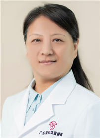

<!-- AUTO-GENERATED-BY: work/generate_obsidian_profiles.py -->

<!-- TEMPLATE: D:\workspace\信息收集整理\医生画像仓库\模板\医生画像模板.md -->

# 高利伟

## 基础信息

| 字段 | 内容 |
|---|---|
| 姓名 | 高利伟 |
| 医院 | 广东省妇幼保健院 |
| 科室 | 儿科消化（番禺院区、越秀院区） |
| 职称/身份 | 主任医师 |
| 来源链接 | [官网原文](https://www.e3861.com/keshizhuanjia/zhuanjiajieshao/32831.html) |
| 采集日期 | 2026-08-14 |

## 简介/擅长

## 教育与进修经历

- 广东省住院医师规范化培训基地评估专家 ；
- 教育部学位与研究生教育发展中心学位论文质量监测评审专家；

## 科研项目与成果

- 【科研成果】 主持及参与国家自然基金与省级课题5项，发表SCI核心期刊等学术论文20余篇。

## 论文与学术产出

- 【科研成果】 主持及参与国家自然基金与省级课题5项，发表SCI核心期刊等学术论文20余篇。
- 教育部学位与研究生教育发展中心学位论文质量监测评审专家；

## 可包装亮点

- 主任医师 硕士研究生导师 【擅长领域】 主攻儿童肝胆与消化营养性疾病领域多年，尤其擅长儿童黄疸查因、胆道闭锁早期诊断、肝功能异常、转氨酶升高、胆汁酸高、肝脾大、婴儿胆汁淤积症、感染与药物性肝损伤、胆管炎、急慢性肝病、肝纤维化、肝硬化、肝衰竭等终末期肝病、家族性肝内胆汁淤积症、胆汁酸合成缺陷、糖原贮积病、肝豆状核变性、高脂血症、儿童肥胖并脂肪性肝病减重管理…
- 对急慢性呼吸系统、儿童危重症救治等均有丰富经验。
- 【科研成果】 主持及参与国家自然基金与省级课题5项，发表SCI核心期刊等学术论文20余篇。
- 【学术任职】 广东省医学教育协会儿科学专业委员会第二届副主任委员；

## 重点疾病/人群标签

- 慢性病：高脂血症、慢性、代谢、免疫、感染、术后、康复、营养、疑难、危重
- 肿瘤：
- 生殖疾病：
- 免疫/风湿：高脂血症、慢性、代谢、免疫、感染、术后、康复、营养、疑难、危重
- 术后恢复/康复：高脂血症、慢性、代谢、免疫、感染、术后、康复、营养、疑难、危重
- 疑难重症：高脂血症、慢性、代谢、免疫、感染、术后、康复、营养、疑难、危重

## 证据摘录

> 只摘录官网公开信息中的短句或关键字段，不复制大段原文。

- 官网身份字段：主任医师
- 官网亮眼经历线索：主任医师 硕士研究生导师 【擅长领域】 主攻儿童肝胆与消化营养性疾病领域多年，尤其擅长儿童黄疸查因、胆道闭锁早期诊断、肝功能异常、转氨酶升高、胆汁酸高、肝脾大、婴儿胆汁淤积症、感染与药物性肝损伤、胆管炎、急慢性肝病、肝纤维化、肝硬化、肝衰竭等终末期肝病、家族性肝内胆汁淤积症、胆汁酸合成缺陷、糖原贮积病、肝豆状核变性、高脂血症、儿童肥胖并脂肪性肝病减重管理，以及各类儿童疑难危重、免疫与遗传代谢相关性肝病的诊治。 对急慢性呼吸系统、儿童危…
- 来源链接：https://www.e3861.com/keshizhuanjia/zhuanjiajieshao/32831.html

## BD 画像摘要

高利伟医生可作为慢性病、免疫/风湿/感染、术后恢复/康复、疑难重症方向的基础画像候选。后续 BD 使用应继续以官网来源和人工复核为准，不添加疗效承诺或无来源包装。

## 合规边界

- 仅使用医院官网、官方公众号、官方小程序等公开渠道。
- 不采集私人电话、私人微信、家庭住址、患者隐私或非公开排班信息。
- 不写“保证治愈”“疗效第一”“包治疑难杂症”等无法由官网证明的表述。
