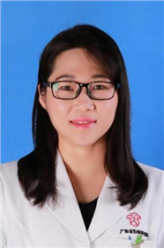

<!-- AUTO-GENERATED-BY: work/generate_obsidian_profiles.py -->

<!-- TEMPLATE: D:\workspace\信息收集整理\医生画像仓库\模板\医生画像模板.md -->

# 黄晓晖

## 基础信息

| 字段 | 内容 |
|---|---|
| 姓名 | 黄晓晖 |
| 医院 | 广东省妇幼保健院 |
| 科室 | 妇科（天河院区） |
| 职称/身份 | 主任医师 |
| 来源链接 | [官网原文](https://www.e3861.com/keshizhuanjia/zhuanjiajieshao/32562.html) |
| 采集日期 | 2026-08-14 |

## 简介/擅长

## 教育与进修经历

- 主任医师，医学博士，毕业于中山大学医学院 专业方向：擅长妇科良性肿瘤、妇科内分泌疾病的规范诊治，擅长宫腔镜、腹腔镜微创手术，诊治子宫内膜异位症、子宫肌瘤、卵巢肿瘤、子宫内膜癌、多囊卵巢综合征、月经病、不孕症等经验丰富。
- 学术成果：第一作者发表SCI论文3篇、中文论文10余篇，主持《孕激素治疗子宫内膜息肉有效基因筛选及生物学验证》等课题、参与制定《合并子宫体良性肿瘤的早期人工流产专家共识》、参与翻译住院医师规范化培训推荐用书《模拟医学》，参与编写《异位妊娠诊断与治疗》、《多囊卵巢综合征100问》等。
- 社会任职及荣誉： 广东省医学会妇产科分会子宫内膜异位症学组成员 广东省妇幼保健协会妇科专业委员会宫腔镜学组委员 广东省女医师协会妇科专业委员会常务委员 广东省基层医药学会生育调控专业委员会常务委员 广东省医师协会妇产科分会普通妇科专业组秘书 中国妇幼保健协会妇科智能医学专业委员会青年学组委员 妇产科住院医师规范化培训基地导师 国家四级内镜培训基地教师 入选广州实力中青年医生

## 科研项目与成果

- 学术成果：第一作者发表SCI论文3篇、中文论文10余篇，主持《孕激素治疗子宫内膜息肉有效基因筛选及生物学验证》等课题、参与制定《合并子宫体良性肿瘤的早期人工流产专家共识》、参与翻译住院医师规范化培训推荐用书《模拟医学》，参与编写《异位妊娠诊断与治疗》、《多囊卵巢综合征100问》等。

## 论文与学术产出

- 学术成果：第一作者发表SCI论文3篇、中文论文10余篇，主持《孕激素治疗子宫内膜息肉有效基因筛选及生物学验证》等课题、参与制定《合并子宫体良性肿瘤的早期人工流产专家共识》、参与翻译住院医师规范化培训推荐用书《模拟医学》，参与编写《异位妊娠诊断与治疗》、《多囊卵巢综合征100问》等。

## 可包装亮点

- 主任医师，医学博士，毕业于中山大学医学院 专业方向：擅长妇科良性肿瘤、妇科内分泌疾病的规范诊治，擅长宫腔镜、腹腔镜微创手术，诊治子宫内膜异位症、子宫肌瘤、卵巢肿瘤、子宫内膜癌、多囊卵巢综合征、月经病、不孕症等经验丰富。
- 学术成果：第一作者发表SCI论文3篇、中文论文10余篇，主持《孕激素治疗子宫内膜息肉有效基因筛选及生物学验证》等课题、参与制定《合并子宫体良性肿瘤的早期人工流产专家共识》、参与翻译住院医师规范化培训推荐用书《模拟医学》，参与编写《异位妊娠诊断与治疗》、《多囊卵巢综合征100问》等。
- 社会任职及荣誉： 广东省医学会妇产科分会子宫内膜异位症学组成员 广东省妇幼保健协会妇科专业委员会宫腔镜学组委员 广东省女医师协会妇科专业委员会常务委员 广东省基层医药学会生育调控专业委员会常务委员 广东省医师协会妇产科分会普通妇科专业组秘书 中国妇幼保健协会妇科智能医学专业委员会青年学组委员 妇产科住院医师规范化培训基地导师 国...

## 重点疾病/人群标签

- 慢性病：
- 肿瘤：肿瘤、癌、瘤、不孕、卵巢、妇科内分泌、多囊、月经
- 生殖疾病：肿瘤、癌、瘤、不孕、卵巢、妇科内分泌、多囊、月经
- 免疫/风湿：
- 术后恢复/康复：
- 疑难重症：

## 证据摘录

> 只摘录官网公开信息中的短句或关键字段，不复制大段原文。

- 官网身份字段：主任医师
- 官网亮眼经历线索：主任医师，医学博士，毕业于中山大学医学院 专业方向：擅长妇科良性肿瘤、妇科内分泌疾病的规范诊治，擅长宫腔镜、腹腔镜微创手术，诊治子宫内膜异位症、子宫肌瘤、卵巢肿瘤、子宫内膜癌、多囊卵巢综合征、月经病、不孕症等经验丰富。 学术成果：第一作者发表SCI论文3篇、中文论文10余篇，主持《孕激素治疗子宫内膜息肉有效基因筛选及生物学验证》等课题、参与制定《合并子宫体良性肿瘤的早期人工流产专家共识》、参与翻译住院医师规范化培训推荐用书《模拟医学》…
- 来源链接：https://www.e3861.com/keshizhuanjia/zhuanjiajieshao/32562.html

## BD 画像摘要

黄晓晖医生可作为肿瘤、生殖疾病方向的基础画像候选。后续 BD 使用应继续以官网来源和人工复核为准，不添加疗效承诺或无来源包装。

## 合规边界

- 仅使用医院官网、官方公众号、官方小程序等公开渠道。
- 不采集私人电话、私人微信、家庭住址、患者隐私或非公开排班信息。
- 不写“保证治愈”“疗效第一”“包治疑难杂症”等无法由官网证明的表述。
