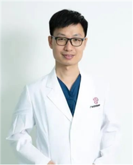

<!-- AUTO-GENERATED-BY: work/generate_obsidian_profiles.py -->

<!-- TEMPLATE: D:\workspace\信息收集整理\医生画像仓库\模板\医生画像模板.md -->

# 黄景思

## 基础信息

| 字段 | 内容 |
|---|---|
| 姓名 | 黄景思 |
| 医院 | 广东省妇幼保健院 |
| 科室 | 心脏中心（番禺院区） |
| 职称/身份 | 副主任医师 |
| 来源链接 | [官网原文](https://www.e3861.com/keshizhuanjia/zhuanjiajieshao/33045.html) |
| 采集日期 | 2026-08-14 |

## 简介/擅长

## 科研项目与成果

- 主刀及参与各种心脏及气管手术5000余例，发表核心及SCI论文20篇，主持省级课题两项，中国胸心血管外科临床杂志审稿专家，曾受邀欧洲先天性心脏病年会(ECHSA)、美国心脏大会(AATS)及国内各种学术会议上发言。

## 论文与学术产出

- 主刀及参与各种心脏及气管手术5000余例，发表核心及SCI论文20篇，主持省级课题两项，中国胸心血管外科临床杂志审稿专家，曾受邀欧洲先天性心脏病年会(ECHSA)、美国心脏大会(AATS)及国内各种学术会议上发言。

## 可包装亮点

- 副主任医师 心脏中心党支部书记 心脏中心负责人 心外科主任 广东省医师协会心血管外科医师分会常务委员 广东省医学会胸心血管外科学分会委员 广东省医师协会小儿心血管病医师分会常务委员 广东省医学会小儿外科学分会心胸学组委员 广东省医师协会体外生命支持专业委员会委员 中国胸心血管外科临床杂志第六届审稿专家 国家儿童医学中心授予“心血管外科学科带头人”称号，获全…
- 主刀及参与各种心脏及气管手术5000余例，发表核心及SCI论文20篇，主持省级课题两项，中国胸心血管外科临床杂志审稿专家，曾受邀欧洲先天性心脏病年会(ECHSA)、美国心脏大会(AATS)及国内各种学术会议上发言。
- 研究方向： 擅长危重新生儿及复杂先心病的外科治疗；
- 降主动脉移植术等复杂危重先心病手术及气管、支气管、隆突成形术。

## 重点疾病/人群标签

- 慢性病：
- 肿瘤：
- 生殖疾病：
- 免疫/风湿：
- 术后恢复/康复：
- 疑难重症：危重、复杂

## 证据摘录

> 只摘录官网公开信息中的短句或关键字段，不复制大段原文。

- 官网身份字段：副主任医师
- 官网亮眼经历线索：副主任医师 心脏中心党支部书记 心脏中心负责人 心外科主任 广东省医师协会心血管外科医师分会常务委员 广东省医学会胸心血管外科学分会委员 广东省医师协会小儿心血管病医师分会常务委员 广东省医学会小儿外科学分会心胸学组委员 广东省医师协会体外生命支持专业委员会委员 中国胸心血管外科临床杂志第六届审稿专家 国家儿童医学中心授予“心血管外科学科带头人”称号，获全国先心外科“第二届“启航杯”手术视频大赛”第二名，获广东省医学会小儿外科第三届手…
- 来源链接：https://www.e3861.com/keshizhuanjia/zhuanjiajieshao/33045.html

## BD 画像摘要

黄景思医生可作为疑难重症方向的基础画像候选。后续 BD 使用应继续以官网来源和人工复核为准，不添加疗效承诺或无来源包装。

## 合规边界

- 仅使用医院官网、官方公众号、官方小程序等公开渠道。
- 不采集私人电话、私人微信、家庭住址、患者隐私或非公开排班信息。
- 不写“保证治愈”“疗效第一”“包治疑难杂症”等无法由官网证明的表述。
