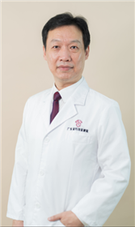

<!-- AUTO-GENERATED-BY: work/generate_obsidian_profiles.py -->

<!-- TEMPLATE: D:\workspace\信息收集整理\医生画像仓库\模板\医生画像模板.md -->

# 黄群

## 基础信息

| 字段 | 内容 |
|---|---|
| 姓名 | 黄群 |
| 医院 | 广东省妇幼保健院 |
| 科室 | 口腔科（番禺院区） |
| 职称/身份 | 主任医师 |
| 来源链接 | [官网原文](https://www.e3861.com/keshizhuanjia/zhuanjiajieshao/32496.html) |
| 采集日期 | 2026-08-14 |

## 简介/擅长

牙颌面疑难疾病的诊治、唇腭裂序列治疗、牙颌面整形（正颌外科）、口腔种植及智齿外科、异常语音诊治、孕产妇及儿童口腔疾病诊治。

## 教育与进修经历

- 主任医师 研究生导师 广东省妇幼保健院国家住院医师规范化培训基地“口腔全科”基地主任 特聘专家 毕业于武汉大学，曾留学德国，师从于国际著名整形及口腔种植专家Friedrich Wilhelm Neukam教授。

## 科研项目与成果

- 长期从事口腔医学临床、教学和科研工作，对口腔及颌面部各类疾病的防治具有丰富经验。
- 参与唇腭裂综合序列治疗30多年，受邀赴全国多地进行婴幼儿出生缺陷防治授课和手术指导，曾获美国“微笑列车”唇腭裂治疗十年“突出贡献天使奖”，是广州市“唇腭裂三级防控及综合序列治疗”特色项目首席专家。
- 参与多项国家和省部级重点课题研究，发表学术论文60多篇。

## 论文与学术产出

- 参与多项国家和省部级重点课题研究，发表学术论文60多篇。

## 可包装亮点

- 主任医师 研究生导师 广东省妇幼保健院国家住院医师规范化培训基地“口腔全科”基地主任 特聘专家 毕业于武汉大学，曾留学德国，师从于国际著名整形及口腔种植专家Friedrich Wilhelm Neukam教授。
- 参与唇腭裂综合序列治疗30多年，受邀赴全国多地进行婴幼儿出生缺陷防治授课和手术指导，曾获美国“微笑列车”唇腭裂治疗十年“突出贡献天使奖”，是广州市“唇腭裂三级防控及综合序列治疗”特色项目首席专家。
- 参与多项国家和省部级重点课题研究，发表学术论文60多篇。
- 担任国家卫生健康委员会“五健”促进行动口腔保健专家组成员，是中国疾控中心“妇幼保健质量与控制指南–儿童口腔保健”的编制者之一。

## 重点疾病/人群标签

- 慢性病：
- 肿瘤：
- 生殖疾病：
- 免疫/风湿：
- 术后恢复/康复：康复、疑难
- 疑难重症：康复、疑难

## 证据摘录

> 只摘录官网公开信息中的短句或关键字段，不复制大段原文。

- 官网身份字段：主任医师
- 官网简介/擅长：牙颌面疑难疾病的诊治、唇腭裂序列治疗、牙颌面整形（正颌外科）、口腔种植及智齿外科、异常语音诊治、孕产妇及儿童口腔疾病诊治。
- 官网亮眼经历线索：主任医师 研究生导师 广东省妇幼保健院国家住院医师规范化培训基地“口腔全科”基地主任 特聘专家 毕业于武汉大学，曾留学德国，师从于国际著名整形及口腔种植专家Friedrich Wilhelm Neukam教授。 参与唇腭裂综合序列治疗30多年，受邀赴全国多地进行婴幼儿出生缺陷防治授课和手术指导，曾获美国“微笑列车”唇腭裂治疗十年“突出贡献天使奖”，是广州市“唇腭裂三级防控及综合序列治疗”特色项目首席专家。 参与多项国家和省部级重点课题…
- 来源链接：https://www.e3861.com/keshizhuanjia/zhuanjiajieshao/32496.html

## BD 画像摘要

黄群医生可作为术后恢复/康复、疑难重症方向的基础画像候选。后续 BD 使用应继续以官网来源和人工复核为准，不添加疗效承诺或无来源包装。

## 合规边界

- 仅使用医院官网、官方公众号、官方小程序等公开渠道。
- 不采集私人电话、私人微信、家庭住址、患者隐私或非公开排班信息。
- 不写“保证治愈”“疗效第一”“包治疑难杂症”等无法由官网证明的表述。
