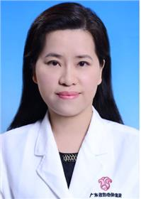

<!-- AUTO-GENERATED-BY: work/generate_obsidian_profiles.py -->

<!-- TEMPLATE: D:\workspace\信息收集整理\医生画像仓库\模板\医生画像模板.md -->

# 黄翠玉

## 基础信息

| 字段 | 内容 |
|---|---|
| 姓名 | 黄翠玉 |
| 医院 | 广东省妇幼保健院 |
| 科室 | 生殖健康与不孕症科（越秀院区） |
| 职称/身份 | 主任医师 |
| 来源链接 | [官网原文](https://www.e3861.com/keshizhuanjia/zhuanjiajieshao/32537.html) |
| 采集日期 | 2026-08-14 |

## 简介/擅长

擅长不孕不育诊断与治疗、人工授精及体外受精-胚胎移植的指征、时机、促排卵方案、手术操作、并发症处理及减胎手术操作。研究方向：再生育问题、多囊卵巢综合征及子宫内膜异位症的诊治。

## 科研项目与成果

- 生殖中心副主任 学术任职：广东省科技厅基金项目评审专家、广东和谐医患纠纷人民调解委员会医学专家顾问、胎儿医学全生命周期诊疗中心专家库生殖健康与不孕症科专家、国际医药卫生导报编辑委员会通讯委员、广州市医学会医疗事故技术鉴定专家库和医疗损害鉴定专家库成员；

## 可包装亮点

- 生殖中心副主任 学术任职：广东省科技厅基金项目评审专家、广东和谐医患纠纷人民调解委员会医学专家顾问、胎儿医学全生命周期诊疗中心专家库生殖健康与不孕症科专家、国际医药卫生导报编辑委员会通讯委员、广州市医学会医疗事故技术鉴定专家库和医疗损害鉴定专家库成员；

## 重点疾病/人群标签

- 慢性病：
- 肿瘤：
- 生殖疾病：生殖、不孕、卵巢、胚胎、多囊
- 免疫/风湿：
- 术后恢复/康复：
- 疑难重症：

## 证据摘录

> 只摘录官网公开信息中的短句或关键字段，不复制大段原文。

- 官网身份字段：主任医师
- 官网简介/擅长：擅长不孕不育诊断与治疗、人工授精及体外受精-胚胎移植的指征、时机、促排卵方案、手术操作、并发症处理及减胎手术操作。研究方向：再生育问题、多囊卵巢综合征及子宫内膜异位症的诊治。
- 官网亮眼经历线索：生殖中心副主任 学术任职：广东省科技厅基金项目评审专家、广东和谐医患纠纷人民调解委员会医学专家顾问、胎儿医学全生命周期诊疗中心专家库生殖健康与不孕症科专家、国际医药卫生导报编辑委员会通讯委员、广州市医学会医疗事故技术鉴定专家库和医疗损害鉴定专家库成员；
- 来源链接：https://www.e3861.com/keshizhuanjia/zhuanjiajieshao/32537.html

## BD 画像摘要

黄翠玉医生可作为生殖疾病方向的基础画像候选。后续 BD 使用应继续以官网来源和人工复核为准，不添加疗效承诺或无来源包装。

## 合规边界

- 仅使用医院官网、官方公众号、官方小程序等公开渠道。
- 不采集私人电话、私人微信、家庭住址、患者隐私或非公开排班信息。
- 不写“保证治愈”“疗效第一”“包治疑难杂症”等无法由官网证明的表述。
