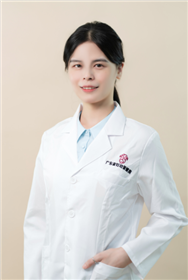

<!-- AUTO-GENERATED-BY: work/generate_obsidian_profiles.py -->

<!-- TEMPLATE: D:\workspace\信息收集整理\医生画像仓库\模板\医生画像模板.md -->

# 黄雪萍

## 基础信息

| 字段 | 内容 |
|---|---|
| 姓名 | 黄雪萍 |
| 医院 | 广东省妇幼保健院 |
| 科室 | 妇女保健科、妇科、更年期、40+女性健康（番禺院区、越秀院区） |
| 职称/身份 | 主治医师 |
| 来源链接 | [官网原文](https://www.e3861.com/keshizhuanjia/zhuanjiajieshao/32597.html) |
| 采集日期 | 2026-08-14 |

## 简介/擅长

## 教育与进修经历

- 主治医师，中西医临床硕士，毕业于广州中医药大学 专业擅长： 2019年毕业至今长期深耕中西医结合在妇女保健领域中的临床与基础研究，擅长中西医融合治疗妇女常见病，包括月经不规则、月经量少、多囊卵巢综合征、卵巢功能减退、更年期综合征、痛经、妇科炎症等，以及不孕症、复发性流产、高龄备孕、孕前调理、早孕安胎，产后康复、女性中医保健养生。

## 科研项目与成果

- 科研成果： 在国内外医学期刊发表学术论文十余篇（含多篇SCI及中文核心期刊），并参与广东省基础与应用基础研究项目，重视临床诊疗的前沿科学性。

## 论文与学术产出

- 科研成果： 在国内外医学期刊发表学术论文十余篇（含多篇SCI及中文核心期刊），并参与广东省基础与应用基础研究项目，重视临床诊疗的前沿科学性。

## 可包装亮点

- 科研成果： 在国内外医学期刊发表学术论文十余篇（含多篇SCI及中文核心期刊），并参与广东省基础与应用基础研究项目，重视临床诊疗的前沿科学性。

## 重点疾病/人群标签

- 慢性病：
- 肿瘤：
- 生殖疾病：不孕、卵巢、多囊、月经、康复
- 免疫/风湿：
- 术后恢复/康复：不孕、卵巢、多囊、月经、康复
- 疑难重症：

## 证据摘录

> 只摘录官网公开信息中的短句或关键字段，不复制大段原文。

- 官网身份字段：主治医师
- 官网亮眼经历线索：科研成果： 在国内外医学期刊发表学术论文十余篇（含多篇SCI及中文核心期刊），并参与广东省基础与应用基础研究项目，重视临床诊疗的前沿科学性。
- 来源链接：https://www.e3861.com/keshizhuanjia/zhuanjiajieshao/32597.html

## BD 画像摘要

黄雪萍医生可作为生殖疾病、术后恢复/康复方向的基础画像候选。后续 BD 使用应继续以官网来源和人工复核为准，不添加疗效承诺或无来源包装。

## 合规边界

- 仅使用医院官网、官方公众号、官方小程序等公开渠道。
- 不采集私人电话、私人微信、家庭住址、患者隐私或非公开排班信息。
- 不写“保证治愈”“疗效第一”“包治疑难杂症”等无法由官网证明的表述。
