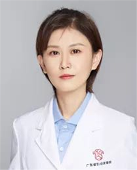

<!-- AUTO-GENERATED-BY: work/generate_obsidian_profiles.py -->

<!-- TEMPLATE: D:\workspace\信息收集整理\医生画像仓库\模板\医生画像模板.md -->

# 齐一鸣

## 基础信息

| 字段 | 内容 |
|---|---|
| 姓名 | 齐一鸣 |
| 医院 | 广东省妇幼保健院 |
| 科室 | 遗传病专科诊疗（番禺院区） |
| 职称/身份 | 医师 |
| 来源链接 | [官网原文](https://www.e3861.com/keshizhuanjia/zhuanjiajieshao/32927.html) |
| 采集日期 | 2026-08-14 |

## 简介/擅长

## 教育与进修经历

- 副主任技师，主治医师，硕士生导师 专业特长： 美国贝勒医学院遗传咨询资格认证，英国伦敦大学国王学院访问学者。

## 科研项目与成果

- 科研成果： 主持省级课题3项，国家科技部重点研发计划课题骨干，主要参与国家自然科学基金面上项目、科技部863重大专项、广东省科技厅重大专项等科研项目多个；

## 论文与学术产出

- 在JTM，AJOG，HUMAN GENEICS等志发表SCI论文超20余篇。

## 可包装亮点

- 副主任技师，主治医师，硕士生导师 专业特长： 美国贝勒医学院遗传咨询资格认证，英国伦敦大学国王学院访问学者。
- 科研成果： 主持省级课题3项，国家科技部重点研发计划课题骨干，主要参与国家自然科学基金面上项目、科技部863重大专项、广东省科技厅重大专项等科研项目多个；
- 在JTM，AJOG，HUMAN GENEICS等志发表SCI论文超20余篇。
- 获广东省科技进步二等奖。

## 重点疾病/人群标签

- 慢性病：
- 肿瘤：肿瘤
- 生殖疾病：
- 免疫/风湿：
- 术后恢复/康复：
- 疑难重症：

## 证据摘录

> 只摘录官网公开信息中的短句或关键字段，不复制大段原文。

- 官网身份字段：医师
- 官网亮眼经历线索：副主任技师，主治医师，硕士生导师 专业特长： 美国贝勒医学院遗传咨询资格认证，英国伦敦大学国王学院访问学者。 科研成果： 主持省级课题3项，国家科技部重点研发计划课题骨干，主要参与国家自然科学基金面上项目、科技部863重大专项、广东省科技厅重大专项等科研项目多个； 在JTM，AJOG，HUMAN GENEICS等志发表SCI论文超20余篇。 获广东省科技进步二等奖。
- 来源链接：https://www.e3861.com/keshizhuanjia/zhuanjiajieshao/32927.html

## BD 画像摘要

齐一鸣医生可作为肿瘤方向的基础画像候选。后续 BD 使用应继续以官网来源和人工复核为准，不添加疗效承诺或无来源包装。

## 合规边界

- 仅使用医院官网、官方公众号、官方小程序等公开渠道。
- 不采集私人电话、私人微信、家庭住址、患者隐私或非公开排班信息。
- 不写“保证治愈”“疗效第一”“包治疑难杂症”等无法由官网证明的表述。
