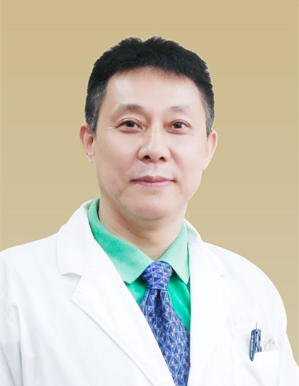

<!-- AUTO-GENERATED-BY: work/generate_obsidian_profiles.py -->

<!-- TEMPLATE: D:\workspace\信息收集整理\医生画像仓库\模板\医生画像模板.md -->

# 于锋

## 基础信息

| 字段 | 内容 |
|---|---|
| 姓名 | 于锋 |
| 医院 | 广东省第二中医院 |
| 科室 | 外二科 |
| 职称/身份 | 主任医师 |
| 来源链接 | [官网原文](https://www.gdzy5413.com/main/ks/templet2/ksdoctorinfo.aspx?bid=50&typeid=48&cid=50&ksid=48&id=79) |
| 采集日期 | 2026-08-12 |

## 简介/擅长

中华医学会外科分会会员。从事外科临床、教学、科研工作三十年，在整形外科、胃肠外科、泌尿外科、小儿外科疾病诊断和治疗方面有较深的造诣，对外科疑难病有丰富的诊治经验。擅长烧伤、外伤后疤痕修复整形、美容整形及泌尿生殖器整形。

## 科研项目与成果

- 从事外科临床、教学、科研工作三十年，在整形外科、胃肠外科、泌尿外科、小儿外科疾病诊断和治疗方面有较深的造诣，对外科疑难病有丰富的诊治经验。

## 可包装亮点

- 中华医学会外科分会会员。
- 从事外科临床、教学、科研工作三十年，在整形外科、胃肠外科、泌尿外科、小儿外科疾病诊断和治疗方面有较深的造诣，对外科疑难病有丰富的诊治经验。

## 重点疾病/人群标签

- 慢性病：
- 肿瘤：
- 生殖疾病：生殖、烧伤、疑难
- 免疫/风湿：
- 术后恢复/康复：生殖、烧伤、疑难
- 疑难重症：生殖、烧伤、疑难

## 证据摘录

> 只摘录官网公开信息中的短句或关键字段，不复制大段原文。

- 官网身份字段：主任医师
- 官网简介/擅长：中华医学会外科分会会员。从事外科临床、教学、科研工作三十年，在整形外科、胃肠外科、泌尿外科、小儿外科疾病诊断和治疗方面有较深的造诣，对外科疑难病有丰富的诊治经验。擅长烧伤、外伤后疤痕修复整形、美容整形及泌尿生殖器整形。
- 官网亮眼经历线索：中华医学会外科分会会员。 从事外科临床、教学、科研工作三十年，在整形外科、胃肠外科、泌尿外科、小儿外科疾病诊断和治疗方面有较深的造诣，对外科疑难病有丰富的诊治经验。
- 来源链接：https://www.gdzy5413.com/main/ks/templet2/ksdoctorinfo.aspx?bid=50&typeid=48&cid=50&ksid=48&id=79

## BD 画像摘要

于锋医生可作为生殖疾病、术后恢复/康复、疑难重症方向的基础画像候选。后续 BD 使用应继续以官网来源和人工复核为准，不添加疗效承诺或无来源包装。

## 合规边界

- 仅使用医院官网、官方公众号、官方小程序等公开渠道。
- 不采集私人电话、私人微信、家庭住址、患者隐私或非公开排班信息。
- 不写“保证治愈”“疗效第一”“包治疑难杂症”等无法由官网证明的表述。
