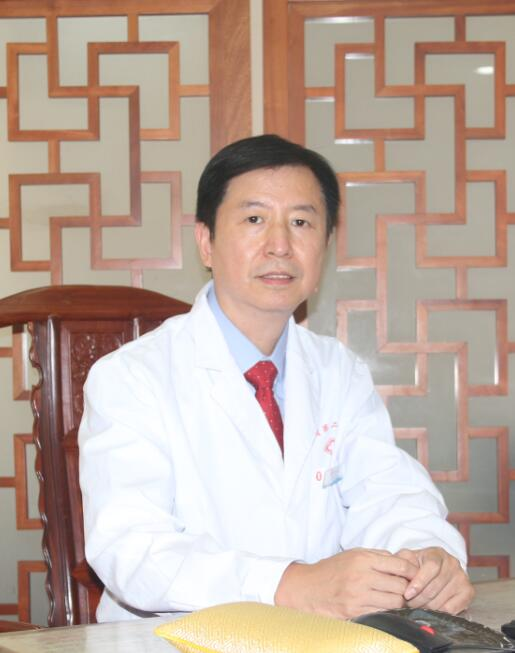

<!-- AUTO-GENERATED-BY: work/generate_obsidian_profiles.py -->

<!-- TEMPLATE: D:\workspace\信息收集整理\医生画像仓库\模板\医生画像模板.md -->

# 刘军

## 基础信息

| 字段 | 内容 |
|---|---|
| 姓名 | 刘军 |
| 医院 | 广东省第二中医院 |
| 科室 |  |
| 职称/身份 | 刘军，院长，中国中医科学院“中青年名中医”，广东省首批“医学领军人才”，主任中医师，博士研究生导师 |
| 来源链接 | [官网原文](https://www.gdzy5413.com/main/doctor/specialist.aspx?typeid=1571) |
| 采集日期 | 2026-08-12 |

## 简介/擅长

中西医结合防治各种疑难骨关节病和脊柱疾病。擅长中西医结合治疗颈椎病、肩周炎、肩袖损伤、腰椎间盘突出症、腰椎管狭窄症、梨状肌综合征、髋膝骨关节病、膝关节交叉韧带及半月板损伤、陈旧性踝关节扭伤、老年性骨质疏松、痛风性关节炎、顽固性软组织（肌肉、腱鞘、韧带、滑囊）劳损性疾病等。

## 科研项目与成果

- 主持国家自然科学基金、教育部、国家中医药管理局等各级课题20余项，主编学术和科普专著10部，发表学术论文168篇（其中SCI收录42篇）。
- 获国家专利8项、软件著...

## 论文与学术产出

- 主持国家自然科学基金、教育部、国家中医药管理局等各级课题20余项，主编学术和科普专著10部，发表学术论文168篇（其中SCI收录42篇）。

## 可包装亮点

- 刘军，院长，中国中医科学院“中青年名中医”，广东省首批“医学领军人才”，主任中医师，博士研究生导师。
- 广州中医药大学中医骨伤科学术带头人，中国中医科学院广东分院（广东省中医药科学院）骨与关节退变及损伤研究团队负责人，全国名老中医学术经验（北京罗氏正骨）继承人，岭南骨伤科学术流派代表性传承人，国家卫健委“手术机器人临床应用管理”专家委员会委员，国家骨科手术机器人应用中心技术指导委员会副主任委员，世界中医药学会联合会骨伤科专业委员会副会长，中华中医药学会骨伤科…
- 主攻中西医结合防治各种疑难骨关节病和脊柱疾病。
- 主持国家自然科学基金、教育部、国家中医药管理局等各级课题20余项，主编学术和科普专著10部，发表学术论文168篇（其中SCI收录42篇）。

## 重点疾病/人群标签

- 慢性病：
- 肿瘤：
- 生殖疾病：
- 免疫/风湿：
- 术后恢复/康复：
- 疑难重症：疑难

## 证据摘录

> 只摘录官网公开信息中的短句或关键字段，不复制大段原文。

- 官网身份字段：刘军，院长，中国中医科学院“中青年名中医”，广东省首批“医学领军人才”，主任中医师，博士研究生导师
- 官网简介/擅长：中西医结合防治各种疑难骨关节病和脊柱疾病。擅长中西医结合治疗颈椎病、肩周炎、肩袖损伤、腰椎间盘突出症、腰椎管狭窄症、梨状肌综合征、髋膝骨关节病、膝关节交叉韧带及半月板损伤、陈旧性踝关节扭伤、老年性骨质疏松、痛风性关节炎、顽固性软组织（肌肉、腱鞘、韧带、滑囊）劳损性疾病等。
- 官网亮眼经历线索：刘军，院长，中国中医科学院“中青年名中医”，广东省首批“医学领军人才”，主任中医师，博士研究生导师。 广州中医药大学中医骨伤科学术带头人，中国中医科学院广东分院（广东省中医药科学院）骨与关节退变及损伤研究团队负责人，全国名老中医学术经验（北京罗氏正骨）继承人，岭南骨伤科学术流派代表性传承人，国家卫健委“手术机器人临床应用管理”专家委员会委员，国家骨科手术机器人应用中心技术指导委员会副主任委员，世界中医药学会联合会骨伤科专业委员会副会长…
- 来源链接：https://www.gdzy5413.com/main/doctor/specialist.aspx?typeid=1571

## BD 画像摘要

刘军医生可作为疑难重症方向的基础画像候选。后续 BD 使用应继续以官网来源和人工复核为准，不添加疗效承诺或无来源包装。

## 合规边界

- 仅使用医院官网、官方公众号、官方小程序等公开渠道。
- 不采集私人电话、私人微信、家庭住址、患者隐私或非公开排班信息。
- 不写“保证治愈”“疗效第一”“包治疑难杂症”等无法由官网证明的表述。
