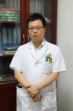

<!-- AUTO-GENERATED-BY: work/generate_obsidian_profiles.py -->

<!-- TEMPLATE: D:\workspace\信息收集整理\医生画像仓库\模板\医生画像模板.md -->

# 李参天

## 基础信息

| 字段 | 内容 |
|---|---|
| 姓名 | 李参天 |
| 医院 | 广东省第二中医院 |
| 科室 | 骨伤三科 |
| 职称/身份 | 副主任中医师、医学硕士 |
| 来源链接 | [官网原文](https://www.gdzy5413.com/main/ks/templet2/ksdoctorinfo.aspx?bid=59&typeid=57&cid=59&ksid=57&id=221) |
| 采集日期 | 2026-08-12 |

## 简介/擅长

擅长用中西医结合方法诊治退行性关节病、脊柱疾病、各种创伤骨科疾病。

## 教育与进修经历

- 毕业于广州中医药大学，从事骨伤科临床、教学、科研工作，擅长用中西医结合方法诊治退行性关节病、脊柱疾病、各种创伤骨科疾病，发表论文多篇，参与厅局级课题2项。

## 科研项目与成果

- 毕业于广州中医药大学，从事骨伤科临床、教学、科研工作，擅长用中西医结合方法诊治退行性关节病、脊柱疾病、各种创伤骨科疾病，发表论文多篇，参与厅局级课题2项。

## 论文与学术产出

- 毕业于广州中医药大学，从事骨伤科临床、教学、科研工作，擅长用中西医结合方法诊治退行性关节病、脊柱疾病、各种创伤骨科疾病，发表论文多篇，参与厅局级课题2项。

## 可包装亮点

- 毕业于广州中医药大学，从事骨伤科临床、教学、科研工作，擅长用中西医结合方法诊治退行性关节病、脊柱疾病、各种创伤骨科疾病，发表论文多篇，参与厅局级课题2项。

## 重点疾病/人群标签

- 慢性病：
- 肿瘤：
- 生殖疾病：
- 免疫/风湿：
- 术后恢复/康复：
- 疑难重症：

## 证据摘录

> 只摘录官网公开信息中的短句或关键字段，不复制大段原文。

- 官网身份字段：副主任中医师、医学硕士
- 官网简介/擅长：擅长用中西医结合方法诊治退行性关节病、脊柱疾病、各种创伤骨科疾病。
- 官网亮眼经历线索：毕业于广州中医药大学，从事骨伤科临床、教学、科研工作，擅长用中西医结合方法诊治退行性关节病、脊柱疾病、各种创伤骨科疾病，发表论文多篇，参与厅局级课题2项。
- 来源链接：https://www.gdzy5413.com/main/ks/templet2/ksdoctorinfo.aspx?bid=59&typeid=57&cid=59&ksid=57&id=221

## BD 画像摘要

李参天医生可作为广东省第二中医院骨伤三科的基础医生资料入库。当前重点方向以总底表标签为准，官网未展示的信息保持空白。

## 合规边界

- 仅使用医院官网、官方公众号、官方小程序等公开渠道。
- 不采集私人电话、私人微信、家庭住址、患者隐私或非公开排班信息。
- 不写“保证治愈”“疗效第一”“包治疑难杂症”等无法由官网证明的表述。
