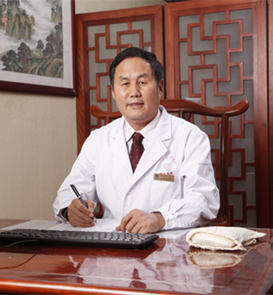

<!-- AUTO-GENERATED-BY: work/generate_obsidian_profiles.py -->

<!-- TEMPLATE: D:\workspace\信息收集整理\医生画像仓库\模板\医生画像模板.md -->

# 王清海

## 基础信息

| 字段 | 内容 |
|---|---|
| 姓名 | 王清海 |
| 医院 | 广东省第二中医院 |
| 科室 |  |
| 职称/身份 | 国务院特殊津贴专家、省名中医、副院长、主任中医师、教授、博士生导师 |
| 来源链接 | [官网原文](https://www.gdzy5413.com/main/doctor/specialist.aspx?typeid=499) |
| 采集日期 | 2026-08-12 |

## 简介/擅长

运用桂枝、黄芪等通阳益气、行气活血、化痰通络的方法治疗心脑血管疾病。在治疗中医内科杂病方面也有丰富的临床经验。

## 科研项目与成果

- 发表论文40余篇，发明治疗高血压、冠心病、心衰的中药制剂三种，获省部级以上科技进步奖4项，举办国家级继续教育项目“高血压中医临床研究进展学习班”3期。

## 论文与学术产出

- 发表论文40余篇，发明治疗高血压、冠心病、心衰的中药制剂三种，获省部级以上科技进步奖4项，举办国家级继续教育项目“高血压中医临床研究进展学习班”3期。

## 可包装亮点

- 国务院特殊津贴专家、省名中医、副院长、主任中医师、教授、博士生导师 广东省中医药学会心血管及疑难病专业委员会副主任委员。
- 发表论文40余篇，发明治疗高血压、冠心病、心衰的中药制剂三种，获省部级以上科技进步奖4项，举办国家级继续教育项目“高血压中医临床研究进展学习班”3期。

## 重点疾病/人群标签

- 慢性病：高血压、冠心病、心力衰竭、心衰、疑难
- 肿瘤：
- 生殖疾病：
- 免疫/风湿：
- 术后恢复/康复：
- 疑难重症：高血压、冠心病、心力衰竭、心衰、疑难

## 证据摘录

> 只摘录官网公开信息中的短句或关键字段，不复制大段原文。

- 官网身份字段：国务院特殊津贴专家、省名中医、副院长、主任中医师、教授、博士生导师
- 官网简介/擅长：运用桂枝、黄芪等通阳益气、行气活血、化痰通络的方法治疗心脑血管疾病。在治疗中医内科杂病方面也有丰富的临床经验。
- 官网亮眼经历线索：国务院特殊津贴专家、省名中医、副院长、主任中医师、教授、博士生导师 广东省中医药学会心血管及疑难病专业委员会副主任委员。 发表论文40余篇，发明治疗高血压、冠心病、心衰的中药制剂三种，获省部级以上科技进步奖4项，举办国家级继续教育项目“高血压中医临床研究进展学习班”3期。
- 来源链接：https://www.gdzy5413.com/main/doctor/specialist.aspx?typeid=499

## BD 画像摘要

王清海医生可作为慢性病、疑难重症方向的基础画像候选。后续 BD 使用应继续以官网来源和人工复核为准，不添加疗效承诺或无来源包装。

## 合规边界

- 仅使用医院官网、官方公众号、官方小程序等公开渠道。
- 不采集私人电话、私人微信、家庭住址、患者隐私或非公开排班信息。
- 不写“保证治愈”“疗效第一”“包治疑难杂症”等无法由官网证明的表述。
