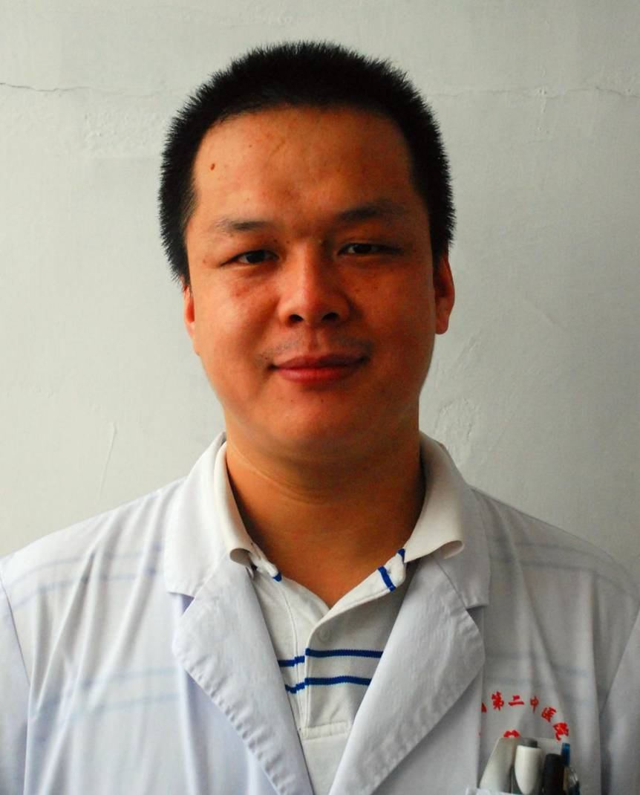

<!-- AUTO-GENERATED-BY: work/generate_obsidian_profiles.py -->

<!-- TEMPLATE: D:\workspace\信息收集整理\医生画像仓库\模板\医生画像模板.md -->

# 苏美意

## 基础信息

| 字段 | 内容 |
|---|---|
| 姓名 | 苏美意 |
| 医院 | 广东省第二中医院 |
| 科室 | 针灸康复五区 |
| 职称/身份 | 硕士研究生、中医师 |
| 来源链接 | [官网原文](https://www.gdzy5413.com/main/ks/templet2/ksdoctorinfo.aspx?bid=97&typeid=95&cid=97&ksid=95&id=646) |
| 采集日期 | 2026-08-12 |

## 简介/擅长

龙氏治脊疗法治疗颈椎病、腰椎间盘突出症、肩周炎等脊柱相关疾病，擅长针灸、浮针、蜂针等治疗中风病及各种痛症。

## 教育与进修经历

- 硕士研究生，毕业于广州中医药大学，师承广东省名中医、龙氏治脊疗法传承人范德辉教授，擅长运用针灸、浮针、龙氏正骨手法治疗脊柱关节疾病，参与省厅级及市局级脊椎病因学相关科研课题多项。

## 科研项目与成果

- 硕士研究生，毕业于广州中医药大学，师承广东省名中医、龙氏治脊疗法传承人范德辉教授，擅长运用针灸、浮针、龙氏正骨手法治疗脊柱关节疾病，参与省厅级及市局级脊椎病因学相关科研课题多项。

## 可包装亮点

- 龙氏治脊疗法治疗颈椎病、腰椎间盘突出症、肩周炎等脊柱相关疾病，擅长针灸、浮针、蜂针等治疗中风病及各种痛症。

## 重点疾病/人群标签

- 慢性病：
- 肿瘤：
- 生殖疾病：
- 免疫/风湿：
- 术后恢复/康复：康复
- 疑难重症：

## 证据摘录

> 只摘录官网公开信息中的短句或关键字段，不复制大段原文。

- 官网身份字段：硕士研究生、中医师
- 官网简介/擅长：龙氏治脊疗法治疗颈椎病、腰椎间盘突出症、肩周炎等脊柱相关疾病，擅长针灸、浮针、蜂针等治疗中风病及各种痛症。
- 来源链接：https://www.gdzy5413.com/main/ks/templet2/ksdoctorinfo.aspx?bid=97&typeid=95&cid=97&ksid=95&id=646

## BD 画像摘要

苏美意医生可作为术后恢复/康复方向的基础画像候选。后续 BD 使用应继续以官网来源和人工复核为准，不添加疗效承诺或无来源包装。

## 合规边界

- 仅使用医院官网、官方公众号、官方小程序等公开渠道。
- 不采集私人电话、私人微信、家庭住址、患者隐私或非公开排班信息。
- 不写“保证治愈”“疗效第一”“包治疑难杂症”等无法由官网证明的表述。
