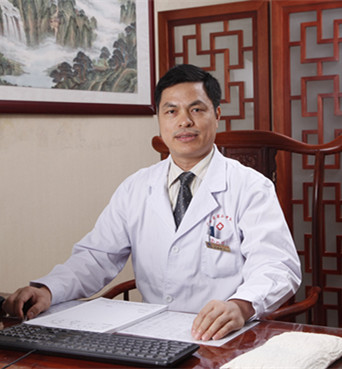

<!-- AUTO-GENERATED-BY: work/generate_obsidian_profiles.py -->

<!-- TEMPLATE: D:\workspace\信息收集整理\医生画像仓库\模板\医生画像模板.md -->

# 范德辉

## 基础信息

| 字段 | 内容 |
|---|---|
| 姓名 | 范德辉 |
| 医院 | 广东省第二中医院 |
| 科室 | 针灸康复科五区、特诊室、针灸康复五区 |
| 职称/身份 | 国务院特殊津贴专家、广东省名中医、主任中医师、二级教授、博士研究生导师、针康五区区长 |
| 来源链接 | [官网原文](https://www.gdzy5413.com/main/doctor/specialist.aspx?typeid=1452) |
| 采集日期 | 2026-08-12 |

## 简介/擅长

中风病、顽固性眩晕、头痛、失眠、各种颈椎病、腰椎间盘突出症、骨质增生症、坐骨神经痛、风湿关节痛及各种创伤术后康复等。

## 科研项目与成果

- 范德辉，主任中医师、二级教授、享受国务院政府特殊津贴专家、广东省名中医，广州中医药大学博士研究生导师，第十二届广东省政协委员，广东省第二中医院针灸康复科五区区长，第五批全国名老中医药学术继承人，广东省第二批名老中医药学术思想继承指导老师，广东省名中医传承工作室专家，中国民族医药学会康复分会副会长、推拿分会副会长、疼痛分会副会长，广东省中西医结合学会脊柱疾病康复专业委员会主任委员，广东省中医药学会针刀专业委员会副主任委员，长期致力于脊柱相关疾病的科研、临床与教学工作，获2018年度广东省科技进步奖二等奖1项，202…
- 主持国家级、省级、市级脊椎病因学相关科研课题多项；

## 论文与学术产出

- 发表学术论文40余篇，主编《龙氏治脊疗法》、《治腰治颈不如靠自己》、《龙氏治脊疗法（第二版）》、《范德辉脊柱相关疾病诊治学术思想与临床经验集》等著作。

## 可包装亮点

- 国务院特殊津贴专家、广东省名中医、主任中医师、二级教授、博士研究生导师、针康五区区长 范德辉，主任中医师、二级教授、享受国务院政府特殊津贴专家、广东省名中医，广州中医药大学博士研究生导师，第十二届广东省政协委员，广东省第二中医院针灸康复科五区区长，第五批全国名老中医药学术继承人，广东省第二批名老中医药学术思想继承指导老师，广东省名中医传承工作室专家，中国民…
- 发表学术论文40余篇，主编《龙氏治脊疗法》、《治腰治颈不如靠自己》、《龙氏治脊疗法（第二版）》、《范德辉脊柱相关疾病诊治学术思想与临床经验集》等著作。

## 重点疾病/人群标签

- 慢性病：
- 肿瘤：
- 生殖疾病：
- 免疫/风湿：风湿、术后、康复、疼痛
- 术后恢复/康复：风湿、术后、康复、疼痛
- 疑难重症：

## 证据摘录

> 只摘录官网公开信息中的短句或关键字段，不复制大段原文。

- 官网身份字段：国务院特殊津贴专家、广东省名中医、主任中医师、二级教授、博士研究生导师、针康五区区长
- 官网简介/擅长：中风病、顽固性眩晕、头痛、失眠、各种颈椎病、腰椎间盘突出症、骨质增生症、坐骨神经痛、风湿关节痛及各种创伤术后康复等。
- 官网亮眼经历线索：国务院特殊津贴专家、广东省名中医、主任中医师、二级教授、博士研究生导师、针康五区区长 范德辉，主任中医师、二级教授、享受国务院政府特殊津贴专家、广东省名中医，广州中医药大学博士研究生导师，第十二届广东省政协委员，广东省第二中医院针灸康复科五区区长，第五批全国名老中医药学术继承人，广东省第二批名老中医药学术思想继承指导老师，广东省名中医传承工作室专家，中国民族医药学会康复分会副会长、推拿分会副会长、疼痛分会副会长，广东省中西医结合学会脊…
- 来源链接：https://www.gdzy5413.com/main/doctor/specialist.aspx?typeid=1452

## BD 画像摘要

范德辉医生可作为免疫/风湿/感染、术后恢复/康复方向的基础画像候选。后续 BD 使用应继续以官网来源和人工复核为准，不添加疗效承诺或无来源包装。

## 合规边界

- 仅使用医院官网、官方公众号、官方小程序等公开渠道。
- 不采集私人电话、私人微信、家庭住址、患者隐私或非公开排班信息。
- 不写“保证治愈”“疗效第一”“包治疑难杂症”等无法由官网证明的表述。
