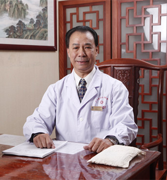

<!-- AUTO-GENERATED-BY: work/generate_obsidian_profiles.py -->

<!-- TEMPLATE: D:\workspace\信息收集整理\医生画像仓库\模板\医生画像模板.md -->

# 邱健行

## 基础信息

| 字段 | 内容 |
|---|---|
| 姓名 | 邱健行 |
| 医院 | 广东省第二中医院 |
| 科室 |  |
| 职称/身份 | 全国名老中医、主任中医师、教授、博士生导师 |
| 来源链接 | [官网原文](https://www.gdzy5413.com/main/doctor/specialist.aspx?typeid=160) |
| 采集日期 | 2026-08-12 |

## 简介/擅长

脾胃病、急慢性胃炎、溃疡病、急慢性结肠炎、功能性胃肠病、肝硬化、急慢性胆囊炎、胆石症、上消化道出血（呕血、便血）、难治性血证、再生障碍性贫血、原发性血小板减少性紫癜、功能性月经过多、顽固性咳嗽、顽固性失眠、顽固性皮肤过敏、习惯性便秘。

## 可包装亮点

- 全国名老中医、主任中医师、教授、博士生导师 历任中华中医学会理事、中华中医内科学会常务理事、全国血证专业委员会副主任委员、广东省中医药学会常务理事、广东省内科学会副主任委员、脾胃病学说研究组组长、广东省老中医药专家协会副会、第九届全国人大代表、主席团成员。

## 重点疾病/人群标签

- 慢性病：慢性、月经、难治
- 肿瘤：
- 生殖疾病：慢性、月经、难治
- 免疫/风湿：
- 术后恢复/康复：
- 疑难重症：慢性、月经、难治

## 证据摘录

> 只摘录官网公开信息中的短句或关键字段，不复制大段原文。

- 官网身份字段：全国名老中医、主任中医师、教授、博士生导师
- 官网简介/擅长：脾胃病、急慢性胃炎、溃疡病、急慢性结肠炎、功能性胃肠病、肝硬化、急慢性胆囊炎、胆石症、上消化道出血（呕血、便血）、难治性血证、再生障碍性贫血、原发性血小板减少性紫癜、功能性月经过多、顽固性咳嗽、顽固性失眠、顽固性皮肤过敏、习惯性便秘。
- 官网亮眼经历线索：全国名老中医、主任中医师、教授、博士生导师 历任中华中医学会理事、中华中医内科学会常务理事、全国血证专业委员会副主任委员、广东省中医药学会常务理事、广东省内科学会副主任委员、脾胃病学说研究组组长、广东省老中医药专家协会副会、第九届全国人大代表、主席团成员。
- 来源链接：https://www.gdzy5413.com/main/doctor/specialist.aspx?typeid=160

## BD 画像摘要

邱健行医生可作为慢性病、生殖疾病、疑难重症方向的基础画像候选。后续 BD 使用应继续以官网来源和人工复核为准，不添加疗效承诺或无来源包装。

## 合规边界

- 仅使用医院官网、官方公众号、官方小程序等公开渠道。
- 不采集私人电话、私人微信、家庭住址、患者隐私或非公开排班信息。
- 不写“保证治愈”“疗效第一”“包治疑难杂症”等无法由官网证明的表述。
