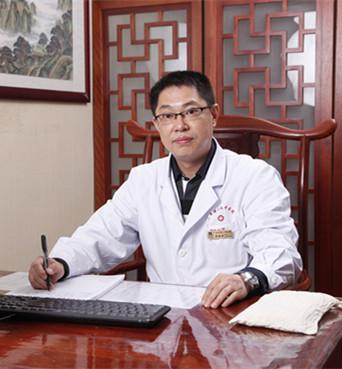

<!-- AUTO-GENERATED-BY: work/generate_obsidian_profiles.py -->

<!-- TEMPLATE: D:\workspace\信息收集整理\医生画像仓库\模板\医生画像模板.md -->

# 郭智涛

## 基础信息

| 字段 | 内容 |
|---|---|
| 姓名 | 郭智涛 |
| 医院 | 广东省第二中医院 |
| 科室 | 乳腺科 |
| 职称/身份 | 乳腺科主任 |
| 来源链接 | [官网原文](https://www.gdzy5413.com/main/doctor/specialist.aspx?typeid=1290) |
| 采集日期 | 2026-08-12 |

## 简介/擅长

中医外治法及心理辅导、饮食疗法等在乳腺病的运用。

## 教育与进修经历

- 1991年起即在广东省中医院乳腺科从事乳腺疾病的医疗及研究工作16年，并在亚洲最大的乳腺病防治中心-天津医科大学肿瘤医院系统培训进修1年。
- 1996年曾参加卫生部第30届全国高级肿瘤医师培训班学习。

## 科研项目与成果

- 主持“术前中药区域动脉持续灌注治疗局部晚期乳腺癌的临床研究”等国家局、省局课题3项，发表专业论文十余篇。

## 论文与学术产出

- 主持“术前中药区域动脉持续灌注治疗局部晚期乳腺癌的临床研究”等国家局、省局课题3项，发表专业论文十余篇。

## 可包装亮点

- 中华医学会肿瘤学会会员，广州市抗癌协会乳腺癌专业委员会委员。
- 1991年起即在广东省中医院乳腺科从事乳腺疾病的医疗及研究工作16年，并在亚洲最大的乳腺病防治中心-天津医科大学肿瘤医院系统培训进修1年。
- 2005年作为学科带头人引进调入广东省第二中医院，并创立乳腺科。
- 掌握乳腺病的专业动态、具备解决本专业危急疑难重症的能力。

## 重点疾病/人群标签

- 慢性病：
- 肿瘤：肿瘤、癌、化疗、乳腺癌、疑难、重症
- 生殖疾病：
- 免疫/风湿：
- 术后恢复/康复：
- 疑难重症：肿瘤、癌、化疗、乳腺癌、疑难、重症

## 证据摘录

> 只摘录官网公开信息中的短句或关键字段，不复制大段原文。

- 官网身份字段：乳腺科主任
- 官网简介/擅长：中医外治法及心理辅导、饮食疗法等在乳腺病的运用。
- 官网亮眼经历线索：中华医学会肿瘤学会会员，广州市抗癌协会乳腺癌专业委员会委员。 1991年起即在广东省中医院乳腺科从事乳腺疾病的医疗及研究工作16年，并在亚洲最大的乳腺病防治中心-天津医科大学肿瘤医院系统培训进修1年。 2005年作为学科带头人引进调入广东省第二中医院，并创立乳腺科。 掌握乳腺病的专业动态、具备解决本专业危急疑难重症的能力。
- 来源链接：https://www.gdzy5413.com/main/doctor/specialist.aspx?typeid=1290

## BD 画像摘要

郭智涛医生可作为肿瘤、疑难重症方向的基础画像候选。后续 BD 使用应继续以官网来源和人工复核为准，不添加疗效承诺或无来源包装。

## 合规边界

- 仅使用医院官网、官方公众号、官方小程序等公开渠道。
- 不采集私人电话、私人微信、家庭住址、患者隐私或非公开排班信息。
- 不写“保证治愈”“疗效第一”“包治疑难杂症”等无法由官网证明的表述。
