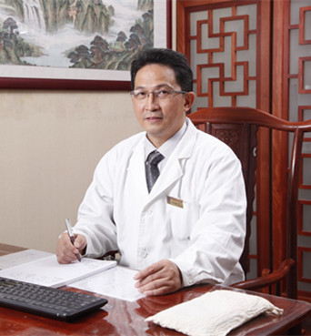

<!-- AUTO-GENERATED-BY: work/generate_obsidian_profiles.py -->

<!-- TEMPLATE: D:\workspace\信息收集整理\医生画像仓库\模板\医生画像模板.md -->

# 陈高峰

## 基础信息

| 字段 | 内容 |
|---|---|
| 姓名 | 陈高峰 |
| 医院 | 广东省第二中医院 |
| 科室 | 肿瘤科 |
| 职称/身份 | 肿瘤科主任、主任医师、教授、硕士研究生导师 |
| 来源链接 | [官网原文](https://www.gdzy5413.com/main/doctor/specialist.aspx?typeid=714) |
| 采集日期 | 2026-08-12 |

## 简介/擅长

论文20多篇，并任《中华医药杂志》常务编委，《现代临床医学全书》副主编。2006年起受聘硕士研究生导师，已培养硕士研究生近20名。从事中西医结合肿瘤内科工作30余年，专业从事各种肿瘤中医药治疗、化疗、粒子植入、氩氦冷消融疗法、热疗、靶向治疗、经皮化学消融疗法、射频消融等治疗。在长期临床工作中，继承并深入发展了孙秉严老中医的“三印辨证”恶性肿瘤诊治方法，并提出“调脏腑，固脾胃，散瘀结，围三留一，开门逐寇”的学术思想，因其创新性和实用性，在临床应用中取得了很好的疗效。尤其对肺癌、胃癌、肝癌、乳癌、前列腺癌、大肠癌、淋巴瘤具有显著疗效，其中中药治疗对炎性乳腺癌及...

## 论文与学术产出

- 中华中医药学会肿瘤专业委员会常委中国民族医药学会肿瘤分会常委世界中医药学会联合会癌症姑息治疗研究专业委员会常务理事中国抗癌协会肿瘤放射性粒子治疗专业委员会委员广东省中西医结合学会肿瘤微创治疗专业委员会主任委员广东省中医药学会肿瘤专业委员会副主任委员广东省中医药学会肿瘤康复与治疗专业委员会副主任委员广东省中西医结合学会肿瘤康复与治疗专业委员会副主任委员广东省中西医结合学会肝胆肿瘤专业委员会副主任委员广州抗癌协会转移专业委员会副主任委员在国内外各类核心期刊发表专科论文20多篇，并任《中华医药杂志》常务编委，《现代临床…

## 可包装亮点

- 中华中医药学会肿瘤专业委员会常委中国民族医药学会肿瘤分会常委世界中医药学会联合会癌症姑息治疗研究专业委员会常务理事中国抗癌协会肿瘤放射性粒子治疗专业委员会委员广东省中西医结合学会肿瘤微创治疗专业委员会主任委员广东省中医药学会肿瘤专业委员会副主任委员广东省中医药学会肿瘤康复与治疗专业委员会副主任委员广东省中西医结合学会肿瘤康复与治疗专业委员会副主任委员广东省…

## 重点疾病/人群标签

- 慢性病：
- 肿瘤：肿瘤、癌、淋巴瘤、化疗、靶向、肺癌、肝癌、胃癌、肠癌、乳腺癌、康复、姑息
- 生殖疾病：
- 免疫/风湿：
- 术后恢复/康复：肿瘤、癌、淋巴瘤、化疗、靶向、肺癌、肝癌、胃癌、肠癌、乳腺癌、康复、姑息
- 疑难重症：

## 证据摘录

> 只摘录官网公开信息中的短句或关键字段，不复制大段原文。

- 官网身份字段：肿瘤科主任、主任医师、教授、硕士研究生导师
- 官网简介/擅长：论文20多篇，并任《中华医药杂志》常务编委，《现代临床医学全书》副主编。2006年起受聘硕士研究生导师，已培养硕士研究生近20名。从事中西医结合肿瘤内科工作30余年，专业从事各种肿瘤中医药治疗、化疗、粒子植入、氩氦冷消融疗法、热疗、靶向治疗、经皮化学消融疗法、射频消融等治疗。在长期临床工作中，继承并深入发展了孙秉严老中医的“三印辨证”恶性肿瘤诊治方法，并提出“调脏腑，固脾胃，散瘀结，围三留一，开门逐寇”的学术思想，因其创新性和实用性…
- 官网亮眼经历线索：中华中医药学会肿瘤专业委员会常委中国民族医药学会肿瘤分会常委世界中医药学会联合会癌症姑息治疗研究专业委员会常务理事中国抗癌协会肿瘤放射性粒子治疗专业委员会委员广东省中西医结合学会肿瘤微创治疗专业委员会主任委员广东省中医药学会肿瘤专业委员会副主任委员广东省中医药学会肿瘤康复与治疗专业委员会副主任委员广东省中西医结合学会肿瘤康复与治疗专业委员会副主任委员广东省中西医结合学会肝胆肿瘤专业委员会副主任委员广州抗癌协会转移专业委员会副主任委员在…
- 来源链接：https://www.gdzy5413.com/main/doctor/specialist.aspx?typeid=714

## BD 画像摘要

陈高峰医生可作为肿瘤、术后恢复/康复方向的基础画像候选。后续 BD 使用应继续以官网来源和人工复核为准，不添加疗效承诺或无来源包装。

## 合规边界

- 仅使用医院官网、官方公众号、官方小程序等公开渠道。
- 不采集私人电话、私人微信、家庭住址、患者隐私或非公开排班信息。
- 不写“保证治愈”“疗效第一”“包治疑难杂症”等无法由官网证明的表述。
