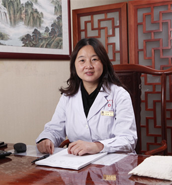

<!-- AUTO-GENERATED-BY: work/generate_obsidian_profiles.py -->

<!-- TEMPLATE: D:\workspace\信息收集整理\医生画像仓库\模板\医生画像模板.md -->

# 高敏

## 基础信息

| 字段 | 内容 |
|---|---|
| 姓名 | 高敏 |
| 医院 | 广东省第二中医院 |
| 科室 | 脑病科 |
| 职称/身份 | 脑病科主任、主任中医师、教授、博士、博士研究生导师 |
| 来源链接 | [官网原文](https://www.gdzy5413.com/main/doctor/specialist.aspx?typeid=614) |
| 采集日期 | 2026-08-12 |

## 简介/擅长

负责人、学科带头人。

## 科研项目与成果

- 承担十一五科技支撑计划重大课题2项；
- 省部级课题7项，厅局级课题10项；
- 从事临床、教学、科研工作近20余年，擅长运用中西医结合方法治疗各种内科疾病及疑难杂症。

## 论文与学术产出

- 获得广东省科技进步二等奖1项、三等奖1项，在核心期刊发表论文50余篇，编写专著5部。

## 可包装亮点

- 广东省中医药学会脑病专业委员会副主任委员,广东省中西医结合学会神经科专业委员会副主任委员,广东省中西医结合学会帕金森病和运动神经元病专业委员会副主任委员,广东省中医药学会心理学专业委员会副主任委员,广东省第二中医院脑病科主任,国家级重点专科负责人、学科带头人。
- 获得广东省科技进步二等奖1项、三等奖1项，在核心期刊发表论文50余篇，编写专著5部。
- 从事临床、教学、科研工作近20余年，擅长运用中西医结合方法治疗各种内科疾病及疑难杂症。

## 重点疾病/人群标签

- 慢性病：
- 肿瘤：
- 生殖疾病：
- 免疫/风湿：
- 术后恢复/康复：
- 疑难重症：疑难

## 证据摘录

> 只摘录官网公开信息中的短句或关键字段，不复制大段原文。

- 官网身份字段：脑病科主任、主任中医师、教授、博士、博士研究生导师
- 官网简介/擅长：负责人、学科带头人。
- 官网亮眼经历线索：广东省中医药学会脑病专业委员会副主任委员,广东省中西医结合学会神经科专业委员会副主任委员,广东省中西医结合学会帕金森病和运动神经元病专业委员会副主任委员,广东省中医药学会心理学专业委员会副主任委员,广东省第二中医院脑病科主任,国家级重点专科负责人、学科带头人。 获得广东省科技进步二等奖1项、三等奖1项，在核心期刊发表论文50余篇，编写专著5部。 从事临床、教学、科研工作近20余年，擅长运用中西医结合方法治疗各种内科疾病及疑难杂症。
- 来源链接：https://www.gdzy5413.com/main/doctor/specialist.aspx?typeid=614

## BD 画像摘要

高敏医生可作为疑难重症方向的基础画像候选。后续 BD 使用应继续以官网来源和人工复核为准，不添加疗效承诺或无来源包装。

## 合规边界

- 仅使用医院官网、官方公众号、官方小程序等公开渠道。
- 不采集私人电话、私人微信、家庭住址、患者隐私或非公开排班信息。
- 不写“保证治愈”“疗效第一”“包治疑难杂症”等无法由官网证明的表述。
