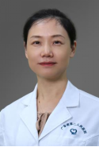

<!-- AUTO-GENERATED-BY: work/generate_obsidian_profiles.py -->

<!-- TEMPLATE: D:\workspace\信息收集整理\医生画像仓库\模板\医生画像模板.md -->

# 何旭英

## 基础信息

| 字段 | 内容 |
|---|---|
| 姓名 | 何旭英 |
| 医院 | 广东省第二人民医院 |
| 科室 | 神经医学中心（琶洲院区） |
| 职称/身份 | 主任医师 |
| 来源链接 | [官网原文](https://gd2h.com/site/detail/42251.html) |
| 采集日期 | 2026-08-15 |

## 简介/擅长

主要擅长于脑动脉瘤、脑动静脉畸形、硬脑膜动静脉瘘、颈动脉海绵窦瘘、脊髓血管病变等血管疾病的介入和手术治疗，掌握各种国际领先的脑脊髓血管病介入治疗技术，如密网支架植入术、覆膜支架植入术、静脉入路栓塞脑动静脉畸形、脊髓动静脉畸形栓塞术等，为华南地区首位密网支架植入术导师，率先在华南地区开展静脉入路栓塞脑动静脉畸形等国内领先技术。

## 教育与进修经历

- 在国内首次开发脑血管病模拟器介入培训课程，到目前为止已举办十五期。

## 科研项目与成果

- 主持国家自然科学基金及广东省科技计划项目等多项基金，主编脑血管病专著《实用神经介入放射学》、《实用颅内动脉瘤血管内治疗学》《颅内动静脉畸形》3部，发表SCI文章累计影响因子45.45，获中华医学科技三等奖1项。

## 论文与学术产出

- 主持国家自然科学基金及广东省科技计划项目等多项基金，主编脑血管病专著《实用神经介入放射学》、《实用颅内动脉瘤血管内治疗学》《颅内动静脉畸形》3部，发表SCI文章累计影响因子45.45，获中华医学科技三等奖1项。

## 可包装亮点

- 个人介绍 何旭英 主任医师 担任广东省第二人民医院神经医学中心主任兼神经内科主任、脑血管病中心主任，医学博士、主任医师，博士生导师，现任中国医师协会神经介入专业青年委员会副主任委员，中国研究型医院学会脑血管病学专业委员会常务委员，广东省医疗行业协会脑血管病管理分会主任委员，广东省医师协会神经介入医师分会副主任委员、出血专业学组组长，广东省医师协会介入放射医…
- 主持国家自然科学基金及广东省科技计划项目等多项基金，主编脑血管病专著《实用神经介入放射学》、《实用颅内动脉瘤血管内治疗学》《颅内动静脉畸形》3部，发表SCI文章累计影响因子45.45，获中华医学科技三等奖1项。
- 2018年广东省杰出青年医学人才；
- 2019年获珠江青年医师奖、羊城好医生，2023年获广东医师奖。

## 重点疾病/人群标签

- 慢性病：
- 肿瘤：瘤
- 生殖疾病：
- 免疫/风湿：
- 术后恢复/康复：
- 疑难重症：

## 证据摘录

> 只摘录官网公开信息中的短句或关键字段，不复制大段原文。

- 官网身份字段：主任医师
- 官网简介/擅长：主要擅长于脑动脉瘤、脑动静脉畸形、硬脑膜动静脉瘘、颈动脉海绵窦瘘、脊髓血管病变等血管疾病的介入和手术治疗，掌握各种国际领先的脑脊髓血管病介入治疗技术，如密网支架植入术、覆膜支架植入术、静脉入路栓塞脑动静脉畸形、脊髓动静脉畸形栓塞术等，为华南地区首位密网支架植入术导师，率先在华南地区开展静脉入路栓塞脑动静脉畸形等国内领先技术。
- 官网亮眼经历线索：个人介绍 何旭英 主任医师 担任广东省第二人民医院神经医学中心主任兼神经内科主任、脑血管病中心主任，医学博士、主任医师，博士生导师，现任中国医师协会神经介入专业青年委员会副主任委员，中国研究型医院学会脑血管病学专业委员会常务委员，广东省医疗行业协会脑血管病管理分会主任委员，广东省医师协会神经介入医师分会副主任委员、出血专业学组组长，广东省医师协会介入放射医师分会常务委员，中国脑卒中学会神经介入分会委员，中国卒中学会青年理事会理事。 主…
- 来源链接：https://gd2h.com/site/detail/42251.html

## BD 画像摘要

何旭英医生可作为肿瘤方向的基础画像候选。后续 BD 使用应继续以官网来源和人工复核为准，不添加疗效承诺或无来源包装。

## 合规边界

- 仅使用医院官网、官方公众号、官方小程序等公开渠道。
- 不采集私人电话、私人微信、家庭住址、患者隐私或非公开排班信息。
- 不写“保证治愈”“疗效第一”“包治疑难杂症”等无法由官网证明的表述。
