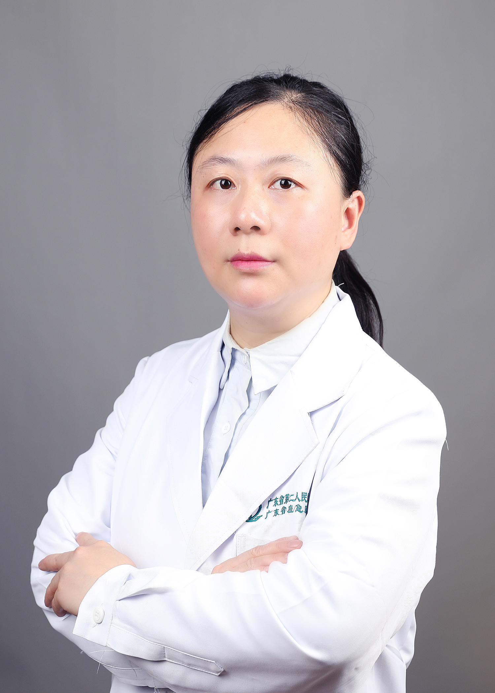

<!-- AUTO-GENERATED-BY: work/generate_obsidian_profiles.py -->

<!-- TEMPLATE: D:\workspace\信息收集整理\医生画像仓库\模板\医生画像模板.md -->

# 何萃

## 基础信息

| 字段 | 内容 |
|---|---|
| 姓名 | 何萃 |
| 医院 | 广东省第二人民医院 |
| 科室 | 耳鼻咽喉头颈外科（琶洲院区） |
| 职称/身份 | 副主任医师 |
| 来源链接 | [官网原文](https://gd2h.com/site/detail/42029.html) |
| 采集日期 | 2026-08-15 |

## 简介/擅长

擅长：1、咽喉、鼾症和嗓音疾病的保守和手术治疗：慢性咽炎、扁桃体炎、阻塞性睡眠呼吸暂停低通气综合征、发声疲劳、声带小结、白斑、息肉、声带沟、声带麻痹、痉挛性发声障碍、癔症性失声等。2、咽喉功能评估：喉肌电图、动态喉镜、吞咽造影。3、常见鼻科疾病的诊治，如鼻窦炎、鼻息肉、过敏性鼻炎、鼻中隔偏曲等。4、鼻咽癌放疗并发症的处理，吞咽嗓音障碍、口腔溃疡、分泌性中耳炎、咽鼓管功能障碍、颈部肌肉纤维化等。5、超声引导肌痉挛和疼痛注射：脑神经、脊神经根、脊神经、关节腔和四肢软组织注射；在带状疱疹后遗神经痛的处理方面经验丰富。

## 科研项目与成果

- 主持省医学科研基金 2 项，院科研基金 1 项， JMIR 审稿人，获得新型专利 3 项，参编吞咽障碍专著 部。

## 论文与学术产出

- 发表论文 10 余篇 (SCI 2 篇 ) 。
- 主持省医学科研基金 2 项，院科研基金 1 项， JMIR 审稿人，获得新型专利 3 项，参编吞咽障碍专著 部。

## 可包装亮点

- 个人介绍 耳鼻喉医师，康复医学副主任医师。
- 发表论文 10 余篇 (SCI 2 篇 ) 。
- 主持省医学科研基金 2 项，院科研基金 1 项， JMIR 审稿人，获得新型专利 3 项，参编吞咽障碍专著 部。

## 重点疾病/人群标签

- 慢性病：慢性、放疗、鼻咽癌、康复、疼痛、功能障碍
- 肿瘤：慢性、放疗、鼻咽癌、康复、疼痛、功能障碍
- 生殖疾病：
- 免疫/风湿：
- 术后恢复/康复：慢性、放疗、鼻咽癌、康复、疼痛、功能障碍
- 疑难重症：

## 证据摘录

> 只摘录官网公开信息中的短句或关键字段，不复制大段原文。

- 官网身份字段：副主任医师
- 官网简介/擅长：擅长：1、咽喉、鼾症和嗓音疾病的保守和手术治疗：慢性咽炎、扁桃体炎、阻塞性睡眠呼吸暂停低通气综合征、发声疲劳、声带小结、白斑、息肉、声带沟、声带麻痹、痉挛性发声障碍、癔症性失声等。2、咽喉功能评估：喉肌电图、动态喉镜、吞咽造影。3、常见鼻科疾病的诊治，如鼻窦炎、鼻息肉、过敏性鼻炎、鼻中隔偏曲等。4、鼻咽癌放疗并发症的处理，吞咽嗓音障碍、口腔溃疡、分泌性中耳炎、咽鼓管功能障碍、颈部肌肉纤维化等。5、超声引导肌痉挛和疼痛注射：脑神经、脊神…
- 官网亮眼经历线索：个人介绍 耳鼻喉医师，康复医学副主任医师。 发表论文 10 余篇 (SCI 2 篇 ) 。 主持省医学科研基金 2 项，院科研基金 1 项， JMIR 审稿人，获得新型专利 3 项，参编吞咽障碍专著 部。
- 来源链接：https://gd2h.com/site/detail/42029.html

## BD 画像摘要

何萃医生可作为慢性病、肿瘤、术后恢复/康复方向的基础画像候选。后续 BD 使用应继续以官网来源和人工复核为准，不添加疗效承诺或无来源包装。

## 合规边界

- 仅使用医院官网、官方公众号、官方小程序等公开渠道。
- 不采集私人电话、私人微信、家庭住址、患者隐私或非公开排班信息。
- 不写“保证治愈”“疗效第一”“包治疑难杂症”等无法由官网证明的表述。
