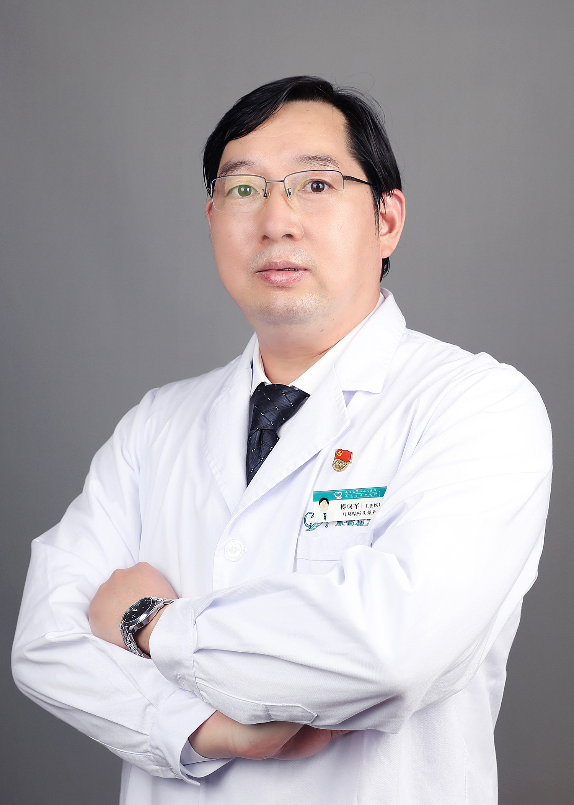

<!-- AUTO-GENERATED-BY: work/generate_obsidian_profiles.py -->

<!-- TEMPLATE: D:\workspace\信息收集整理\医生画像仓库\模板\医生画像模板.md -->

# 傅向军

## 基础信息

| 字段 | 内容 |
|---|---|
| 姓名 | 傅向军 |
| 医院 | 广东省第二人民医院 |
| 科室 | 耳鼻咽喉头颈外科（琶洲院区） |
| 职称/身份 | 主任医师 |
| 来源链接 | [官网原文](https://gd2h.com/site/detail/42027.html) |
| 采集日期 | 2026-08-15 |

## 简介/擅长

擅长：1、甲状腺肿瘤的诊断与外科治疗，颈淋巴清扫；2、喉部良、恶性肿瘤诊疗，喉部分切除、全喉切除及喉功能重建手术；3、内镜下咽喉部疾病微创、激光手术；4、鼻腔、鼻窦炎症性疾病的内镜手术；5、鼻窦肿瘤切除与修复，上颌骨切除；6、腮腺良恶性病变诊治及颅外段面神经解剖；7、鼻咽癌的早期诊断与综合治疗；8、马德龙病外科治疗。

## 科研项目与成果

- 主持、参与省级科研项目 6 项，发表专业论文二十余篇， SCI 一篇。

## 论文与学术产出

- 主持、参与省级科研项目 6 项，发表专业论文二十余篇， SCI 一篇。

## 可包装亮点

- 中国医学救援协会救援防护分会理事；
- 中华医学会广州市耳鼻咽喉头颈外科学分会委员；
- 广东省医疗行业协会耳鼻咽喉头颈外科管理委员会副主委；
- 广东省临床医学学会喉咽肿瘤专业委员会常委；

## 重点疾病/人群标签

- 慢性病：
- 肿瘤：肿瘤、鼻咽癌
- 生殖疾病：
- 免疫/风湿：
- 术后恢复/康复：
- 疑难重症：

## 证据摘录

> 只摘录官网公开信息中的短句或关键字段，不复制大段原文。

- 官网身份字段：主任医师
- 官网简介/擅长：擅长：1、甲状腺肿瘤的诊断与外科治疗，颈淋巴清扫；2、喉部良、恶性肿瘤诊疗，喉部分切除、全喉切除及喉功能重建手术；3、内镜下咽喉部疾病微创、激光手术；4、鼻腔、鼻窦炎症性疾病的内镜手术；5、鼻窦肿瘤切除与修复，上颌骨切除；6、腮腺良恶性病变诊治及颅外段面神经解剖；7、鼻咽癌的早期诊断与综合治疗；8、马德龙病外科治疗。
- 官网亮眼经历线索：中国医学救援协会救援防护分会理事； 中华医学会广州市耳鼻咽喉头颈外科学分会委员； 广东省医疗行业协会耳鼻咽喉头颈外科管理委员会副主委； 广东省临床医学学会喉咽肿瘤专业委员会常委；
- 来源链接：https://gd2h.com/site/detail/42027.html

## BD 画像摘要

傅向军医生可作为肿瘤方向的基础画像候选。后续 BD 使用应继续以官网来源和人工复核为准，不添加疗效承诺或无来源包装。

## 合规边界

- 仅使用医院官网、官方公众号、官方小程序等公开渠道。
- 不采集私人电话、私人微信、家庭住址、患者隐私或非公开排班信息。
- 不写“保证治愈”“疗效第一”“包治疑难杂症”等无法由官网证明的表述。
