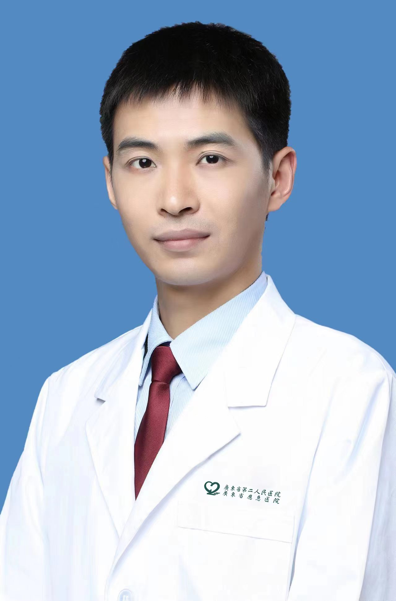

<!-- AUTO-GENERATED-BY: work/generate_obsidian_profiles.py -->

<!-- TEMPLATE: D:\workspace\信息收集整理\医生画像仓库\模板\医生画像模板.md -->

# 刘强

## 基础信息

| 字段 | 内容 |
|---|---|
| 姓名 | 刘强 |
| 医院 | 广东省第二人民医院 |
| 科室 | 肾内科（琶洲院区） |
| 职称/身份 | 主任医师 |
| 来源链接 | [官网原文](https://gd2h.com/site/detail/42134.html) |
| 采集日期 | 2026-08-15 |

## 简介/擅长

擅长肾内科常见病及疑难罕见病的诊治，尤其在原发、继发、遗传肾脏病，如膜性肾病、IgA肾病、糖尿病肾病、高血压肾病、痛风性肾病、狼疮性肾炎、ANCA相关血管炎肾损害、紫癜性肾炎、骨髓瘤肾损害、多囊肾、Alport综合征、肾小管间质病及血液透析、腹膜透析等方面有较深造诣。擅长结合肾脏病理改变和最新国际指南制定个体化的诊治方案，精准及时给药，避免过度治疗和药物副作用。

## 教育与进修经历

- 个人介绍 日本医学博士，博士后，副教授（六级）/副主任医师，硕士研究生导师 全球卫生后备库人才，日本病理学会会员 安徽省医师协会肾脏病分会青委副主委 辽宁省医学会肾脏病学分会青年委员会委员 苏皖赣血液净化血管通路联盟常务理事 安徽省医师协会内科学分会委员 安徽省医学会临床流行病学分会委员 国家自然科学基金委员会评审专家 “第一届安徽省卫生健康骨干人才” “辽宁省高层次人才”，“沈阳市高级人才” 主持国家自然科学基金青年基金、中国博士后面上项目各1项，省级课题4项，校级课题4项，参与多项国家、省、市课题 以第一作者…

## 科研项目与成果

- 个人介绍 日本医学博士，博士后，副教授（六级）/副主任医师，硕士研究生导师 全球卫生后备库人才，日本病理学会会员 安徽省医师协会肾脏病分会青委副主委 辽宁省医学会肾脏病学分会青年委员会委员 苏皖赣血液净化血管通路联盟常务理事 安徽省医师协会内科学分会委员 安徽省医学会临床流行病学分会委员 国家自然科学基金委员会评审专家 “第一届安徽省卫生健康骨干人才” “辽宁省高层次人才”，“沈阳市高级人才” 主持国家自然科学基金青年基金、中国博士后面上项目各1项，省级课题4项，校级课题4项，参与多项国家、省、市课题 以第一作者…

## 可包装亮点

- 个人介绍 日本医学博士，博士后，副教授（六级）/副主任医师，硕士研究生导师 全球卫生后备库人才，日本病理学会会员 安徽省医师协会肾脏病分会青委副主委 辽宁省医学会肾脏病学分会青年委员会委员 苏皖赣血液净化血管通路联盟常务理事 安徽省医师协会内科学分会委员 安徽省医学会临床流行病学分会委员 国家自然科学基金委员会评审专家 “第一届安徽省卫生健康骨干人才” “…

## 重点疾病/人群标签

- 慢性病：高血压、糖尿病、瘤、多囊、疑难、罕见
- 肿瘤：高血压、糖尿病、瘤、多囊、疑难、罕见
- 生殖疾病：高血压、糖尿病、瘤、多囊、疑难、罕见
- 免疫/风湿：
- 术后恢复/康复：
- 疑难重症：高血压、糖尿病、瘤、多囊、疑难、罕见

## 证据摘录

> 只摘录官网公开信息中的短句或关键字段，不复制大段原文。

- 官网身份字段：主任医师
- 官网简介/擅长：擅长肾内科常见病及疑难罕见病的诊治，尤其在原发、继发、遗传肾脏病，如膜性肾病、IgA肾病、糖尿病肾病、高血压肾病、痛风性肾病、狼疮性肾炎、ANCA相关血管炎肾损害、紫癜性肾炎、骨髓瘤肾损害、多囊肾、Alport综合征、肾小管间质病及血液透析、腹膜透析等方面有较深造诣。擅长结合肾脏病理改变和最新国际指南制定个体化的诊治方案，精准及时给药，避免过度治疗和药物副作用。
- 官网亮眼经历线索：个人介绍 日本医学博士，博士后，副教授（六级）/副主任医师，硕士研究生导师 全球卫生后备库人才，日本病理学会会员 安徽省医师协会肾脏病分会青委副主委 辽宁省医学会肾脏病学分会青年委员会委员 苏皖赣血液净化血管通路联盟常务理事 安徽省医师协会内科学分会委员 安徽省医学会临床流行病学分会委员 国家自然科学基金委员会评审专家 “第一届安徽省卫生健康骨干人才” “辽宁省高层次人才”，“沈阳市高级人才” 主持国家自然科学基金青年基金、中国博士后…
- 来源链接：https://gd2h.com/site/detail/42134.html

## BD 画像摘要

刘强医生可作为慢性病、肿瘤、生殖疾病、疑难重症方向的基础画像候选。后续 BD 使用应继续以官网来源和人工复核为准，不添加疗效承诺或无来源包装。

## 合规边界

- 仅使用医院官网、官方公众号、官方小程序等公开渠道。
- 不采集私人电话、私人微信、家庭住址、患者隐私或非公开排班信息。
- 不写“保证治愈”“疗效第一”“包治疑难杂症”等无法由官网证明的表述。
